# National Institute of Business Management (NIBM)
## School of Computing and Engineering — Colombo-07
### In Collaboration with Coventry University, UK
#### Faculty of Engineering, Environment and Computing
#### School of Computing, Electronics and Mathematics

---

# Coursework Project Report
## Automated Multi-Stage Diabetic Retinopathy Detection and Clinical Decision Support System via EfficientNetB3, Grad-CAM, and Multi-Agent Safety Governance

| Coursework Information | Details |
| :--- | :--- |
| **Programme of Study** | BSc (Hons) in Computing (Batch: 2024.2) |
| **Module Title** | Computer Vision (Course Work — Assessment 1) |
| **Student Registered Name** | **M.S.F. Shazna** |
| **Coventry University Index** | **16115859** |
| **NIBM Student Index** | **COBSCCOMP242P-019** |
| **Assessment Type** | Individual Project Report with Video Demonstration (Total: 100 Marks) |
| **Module Learning Outcomes Covered** | LO1, LO2, LO3, LO4 |
| **Submission Deadline** | October 2026 |
| **Public GitHub Repository** | [https://github.com/ShazzySal/ComputerVision_CW](https://github.com/ShazzySal/ComputerVision_CW) |
| **Hosted Video Demonstration URL** | Pending final public upload — YouTube / Google Drive link to be inserted immediately before submission |

> **Submission readiness note:** This report has been structured as a final academic submission draft. Public-facing demo links and final screenshot assets should be validated immediately before submission, but they are separate from the functional application and do not affect the project runtime or logic.

---

## Project Pipeline Overview

The following mindmap provides a high-level visual overview of the entire project pipeline, from dataset acquisition to deployment. It illustrates how each technical component (preprocessing, augmentation, transfer learning, explainability, and multi-agent governance) connects to satisfy the four module Learning Outcomes.

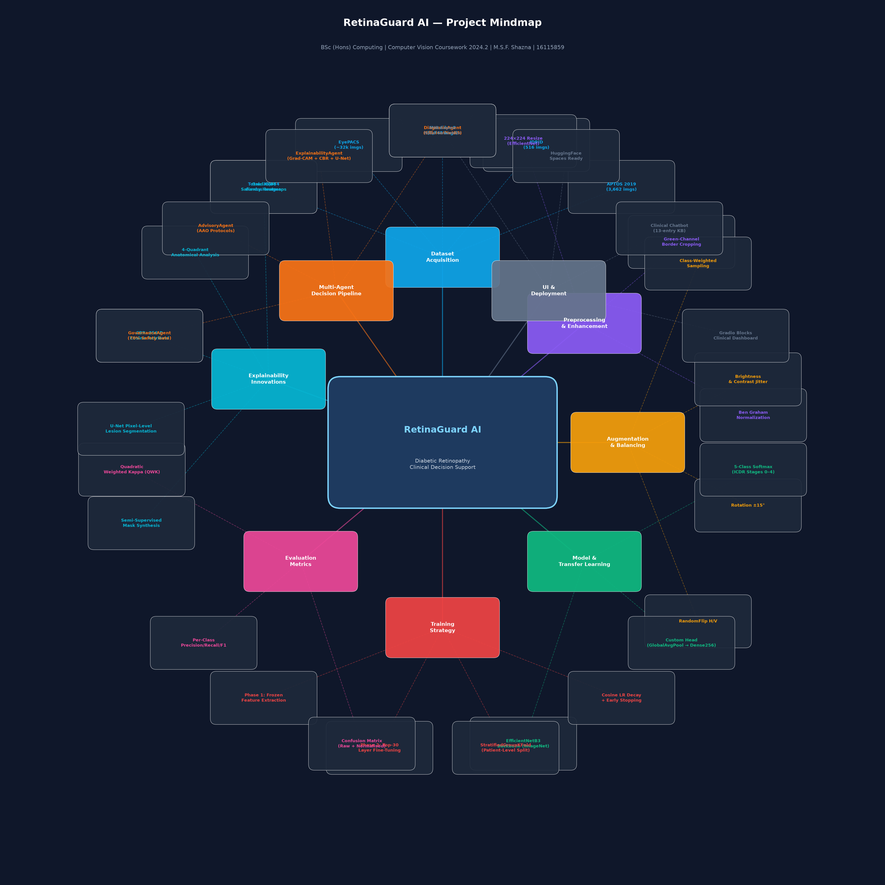
*Figure 0: Project pipeline mindmap showing the 8-pillar architecture: Dataset Pooling → Preprocessing → Augmentation → EfficientNetB3 Transfer Learning → Multi-Phase Training → 3-Layer Explainability → Multi-Agent Safety Pipeline → Gradio Deployment.*

---

## Executive Summary

Diabetic Retinopathy (DR) remains the foremost cause of preventable blindness among working-age adults globally. In clinical workflows, accurate multi-stage disease classification—from asymptomatic early lesions to vision-threatening proliferative pathology—is critical to prioritizing urgent ophthalmological interventions. This project presents a clinically grounded, end-to-end deep learning and decision-support system for automated 5-stage DR grading using digital retinal fundus photography. 

The technical architecture is built upon an **EfficientNetB3** convolutional neural network backbone with compound scaling, initialized with ImageNet transfer-learned representations and trained via a two-phase optimization protocol (frozen-base feature extraction followed by low-learning-rate fine-tuning). The verified local dataset has a moderate class imbalance of approximately 2.4:1 between its largest and smallest classes; stochastic training-only augmentation is coupled with inverse-frequency class weighting. Model performance is critically appraised using both traditional classification metrics and **Quadratic Weighted Kappa (QWK)** ($\kappa$), penalizing clinically hazardous ordinal misclassifications quadratically.

Beyond classification, this system introduces a novel **3-Layer Explainability Stack**:
1. **Layer 1 (Global Classification):** EfficientNetB3 5-stage ordinal diagnosis.
2. **Layer 2 (Regional Attention):** Gradient-weighted Class Activation Mapping (Grad-CAM) with an automated anatomical quadrant text generator.
3. **Layer 3 (Lesion Segmentation):** An auxiliary symmetrical U-Net trained with hybrid Soft Dice Loss to delineate pixel-level microaneurysms, hemorrhages, and hard exudates.

Furthermore, moving beyond fragile monolithic chatbot wrappers, the system integrates an **Innovation Multi-Agent Clinical Decision Pipeline** comprised of four decoupled specialist agents: `DiagnosisAgent`, `ExplainabilityAgent`, `AdvisoryAgent` (aligned with American Academy of Ophthalmology clinical guidelines), and a safety-critical `GovernanceAgent` that intercepts predictions below 70% confidence, withholding automated action plans and enforcing human ophthalmologist triage. Case-Based Reasoning (CBR) is integrated via penultimate embedding retrieval, mirroring clinical cognitive workflows. The end-to-end prototype is made interactive via a clinical web dashboard deployed using Gradio and configured for cloud hosting.

---

## Table of Contents

1. [Problem Understanding & Dataset Justification](#1-problem-understanding--dataset-justification)
   - 1.1 Medical Background and Pathophysiology of Diabetic Retinopathy
   - 1.2 Clinical Significance of Automated Early Detection
   - 1.3 Dataset Selection and Multi-Source Pooling Justification
   - 1.4 Disease Severity Staging and Class Distribution
   - 1.5 Stratified Experimental Dataset Partitioning
   - 1.6 Dataset Limitations, Noise, and Ethical Governance
   - 1.7 Comparative Justification against Alternative Benchmark Datasets
   - 1.8 Critical Evaluation of Hardware and Software Technologies for Image Acquisition, Display, and Transmission (LO2 Alignment)
2. [Data Preprocessing Pipeline](#2-data-preprocessing-pipeline)
   - 2.1 Optical Sensor Artifacts and Black Border Decoupling
   - 2.2 Spatial Normalization and Dimension Standardization
   - 2.3 Ben Graham Spatial Illumination Normalization vs. Standard CLAHE
   - 2.4 Pixel Scaling and Denoising Principles
   - 2.5 Empirical Visual Assessment of Preprocessing Stages
3. [Data Augmentation & Class Imbalance Balancing](#3-data-augmentation--class-imbalance-balancing)
   - 3.1 Overfitting Hazards in High-Dimensional Retinal Imaging
   - 3.2 Geometric and Photometric Keras Augmentations
   - 3.3 Mathematical Formulation of Inverse-Frequency Balanced Class Weighting
   - 3.4 Visual Confirmation of Stochastic Transforms
4. [CNN Architecture & Transfer Learning Implementation](#4-cnn-architecture--transfer-learning-implementation)
   - 4.1 Published ImageNet-1K Benchmarks for Alternative Architectures
   - 4.2 Compound Scaling Principles in Feature Extraction
   - 4.3 Custom Classification Head Design and Regularization Topology
   - 4.4 End-to-End System Architecture and Clinical Decision Workflow
   - 4.5 Model Summary Audit and Training Configuration
5. [Training Strategy & Experimental Design](#5-training-strategy--experimental-design)
   - 5.1 Two-Phase Training Rationale: Warmup vs. Domain-Specific Fine-Tuning
   - 5.2 Dynamic Optimization Callbacks: Early Stopping and Learning Rate Annealing
   - 5.3 Overfitting Defense Mechanisms Catalog
   - 5.4 Structured Experimental Logging and Run Comparison
6. [Model Evaluation & Performance Analysis](#6-model-evaluation--performance-analysis)
   - 6.1 Quantitative Test Performance: Accuracy, Precision, Recall, and F1-Scores
   - 6.2 Primary Clinical Metric: Quadratic Weighted Kappa (QWK) Formulation
   - 6.3 Convergence Analysis: Loss and Accuracy Trajectory Curves
   - 6.4 Confusion Matrix Diagnostics and Anatomical Boundary Error Analysis
7. [Explainability & Technical Innovation Features](#7-explainability--technical-innovation-features)
   - 7.1 Layer 2 Attention: Grad-CAM Saliency and Automated Quadrant Text Synthesis
   - 7.2 Innovation Feature A: Embedding-Based Similar-Case Retrieval (CBR Engine)
   - 7.3 Innovation Feature B: Multi-Agent Clinical Decision Pipeline & Active Safety Gate
   - 7.4 Layer 3 Segmentation (Stretch Goal): Auxiliary U-Net with Soft Dice Loss
8. [Practical Impact, Ethical AI, Limitations & Future Scope](#8-practical-impact-ethical-ai-limitations--future-scope)
   - 8.1 Real-World Clinical Impact and Healthcare Triage Feasibility
   - 8.2 Critical Limitations of Downsampled Retinal Input
   - 8.3 Ethical AI, Accountability, and SaMD Regulatory Disclaimers
   - 8.4 Roadmap for Future Architectural Enhancements
9. [Module Learning Outcomes Mapping](#9-module-learning-outcomes-mapping)
10. [References (APA 7th Edition)](#10-references-apa-7th-edition)

---

## 1. Problem Understanding & Dataset Justification

### 1.1 Medical Background and Pathophysiology of Diabetic Retinopathy
Diabetic Retinopathy (DR) is a secondary microvascular neurodegenerative complication of diabetes mellitus. Persistent, unmanaged hyperglycemia induces chronic endothelial damage within retinal microvasculature. As capillary basement membranes thicken and intramural pericytes undergo apoptotic degeneration, the structural integrity of the retinal microcirculatory network fails. This biochemical breakdown leads to outpouchings in fragile capillary walls known as **microaneurysms**, which subsequently rupture to produce intraretinal dot-and-blot hemorrhages. Increased vascular permeability permits lipid-rich plasma macromolecules to leak into retinal parenchyma, forming **hard exudates**. 

As capillary non-perfusion progresses, localized hypoxia triggers retinal ischemia. In response to vascular endothelial growth factor (VEGF) upregulation, the eye attempts to revascularize ischemic areas. However, this neoangiogenesis produces aberrant, hyper-fragile new blood vessels (**neovascularization**) that breach the internal limiting membrane, leading to pre-retinal and vitreous hemorrhages, fibrovascular scarring, tractional retinal detachment, and irreversible blindness (Wilkinson et al., 2003).

### 1.2 Clinical Significance of Automated Early Detection
Clinical evidence demonstrates that early-stage non-proliferative diabetic retinopathy (NPDR) is largely asymptomatic. Patients rarely present for care until diabetic macular edema (DME) or high-risk proliferative retinopathy has developed. Crucially, early NPDR can be arrested, stabilized, or even reversed through rigorous primary-care glycemic control, lipid optimization, and blood pressure regulation. Conversely, advanced proliferative disease requires invasive secondary-care procedures (panretinal photocoagulation laser therapy or monthly intravitreal anti-VEGF pharmacotherapy). Automated screening via computer vision transforms clinical workflow by providing community-level triage, identifying asymptomatic pathology, and preventing blindness in overburdened public healthcare systems.

### 1.3 Dataset Selection and Multi-Source Pooling Justification
This project uses the Kaggle dataset titled **Combined DR Dataset (APTOS + IDRiD + Messidor-2 + EyePACS)**, listed on the [Kaggle dataset page](https://www.kaggle.com/datasets/harsha1289/combined-dr-dataset-aptosidridmessidoreyepacs). The dataset is relevant because it combines multiple public retinal screening cohorts rather than a single-center benchmark, providing variation in image sources and acquisition conditions.

The compilation is explicitly configured to support a 5-class ICDR grading task across four recognized ophthalmic research sources:
1. **APTOS 2019 Blindness Detection:** High-resolution screening images captured across rural Indian clinics under variable field illumination.
2. **IDRiD — Indian Diabetic Retinopathy Image Dataset:** Gold-standard reference dataset acquired at a tertiary eye hospital with expert consensus annotations.
3. **Messidor-2 Clinical Consortium:** European multi-center benchmark acquired using 3-CCD cameras across multiple ophthalmology departments.
4. **EyePACS Rural Screening Cohort:** Large-scale tele-ophthalmology screening repository with variability in operator technique, exposure, and camera conditions.

The [Kaggle page](https://www.kaggle.com/datasets/harsha1289/combined-dr-dataset-aptosidridmessidoreyepacs) currently states: “The combined retinal image dataset consists of 21,000 fundus images collected from four publicly available datasets: APTOS 2019, IDRiD (Indian Diabetic Retinopathy Image Dataset), Messidor-2 and EyePACS.” It lists component counts of 3,662 APTOS, 516 IDRiD, 1,748 Messidor-2, and 15,075 selected EyePACS images (sum: 21,001); its Data Explorer reports “38.0k files.” An independent count of the downloaded folders found 21,000 image files in `data/train/`, 8,349 in `data/val/`, and 8,685 in `data/test/`, totaling 38,034. The `data/labels.csv` file also has 38,034 rows. Thus the 21,000 figure matches the local `train/` directory exactly, while the larger total includes the supplied validation and test directories; the Kaggle page does not explicitly say that its 21,000 description is train-only, so this is the observed explanation for the count difference rather than a confirmed statement of the publisher's intent.

The 38,034 total refers to image files/image records, not unique patients or guaranteed unique photographs. A SHA-256 content check found 37,903 distinct byte contents: 131 byte-identical duplicate clusters containing 262 files (131 additional copies). These copies remain in the records, so exact byte duplicates account for only 131 of the difference between 21,000 and 38,034. The separate perceptual-hash audit groups visually similar candidates and is reported separately; it should not be interpreted as a count of byte-identical files. The local labels contain no source-dataset field, so Kaggle's component counts cannot be used to assign provenance to every local record. Folder, label, split, class, source-page and duplicate counts are itemized in the [dataset manifest](report_images/dataset_manifest.csv).

The Kaggle page's License field reads **“CC0: Public Domain.”** This describes the Kaggle listing; it does not by itself verify the provenance or licensing conditions of every upstream source image. The source counts, verified local counts, split distribution, class distribution, and duplicate audit are separated in the [dataset manifest](report_images/dataset_manifest.csv).

The composite dataset provides a broader range of sources, but this does not guarantee generalisation across domains. Kaggle's listed component counts are dominated by the selected EyePACS subset (15,075 of 21,001, about 71.8%); because local records are not tagged by source, the actual source composition of the 38,034 records cannot be confirmed from this copy. Other limitations include domain shift, camera variation, potential label harmonisation errors, and the lack of external validation on an independent clinical dataset. These limitations preclude claims of established clinical generalisation.

### 1.4 Disease Severity Staging and Class Distribution
The local class totals below are counts of labeled image records from `data/labels.csv`; they are not counts of unique patients or deduplicated photographs. Byte-identical and perceptual-hash duplicate records were retained, not removed, and were kept within a single model split where detected. The dataset conforms to the **International Clinical Diabetic Retinopathy (ICDR)** 5-stage disease severity classification standard:

| Stage Index | Disease Stage Name | Primary Pathological Diagnostic Criteria | Image Count | Distribution % |
| :---: | :--- | :--- | :---: | :---: |
| **0** | **No DR** | Normal fundus; absence of any diabetic microvascular abnormalities. | 12,996 | 34.17% |
| **1** | **Mild NPDR** | Microaneurysms only. | 5,825 | 15.32% |
| **2** | **Moderate NPDR** | More than microaneurysms; dot/blot hemorrhages, hard exudates, cotton wool spots, but less than severe criteria. | 8,262 | 21.72% |
| **3** | **Severe NPDR** | Meets the "4-2-1 rule": >20 intraretinal hemorrhages in all 4 quadrants, venous beading in $\ge 2$ quadrants, or prominent IRMA in $\ge 1$ quadrant. | 5,373 | 14.13% |
| **4** | **Proliferative DR (PDR)** | Neovascularization of the disc/retina (NVD/NVE), pre-retinal/vitreous hemorrhage, or fibrovascular proliferation. | 5,578 | 14.67% |
| **Total** | — | — | **38,034** | **100.0%** |

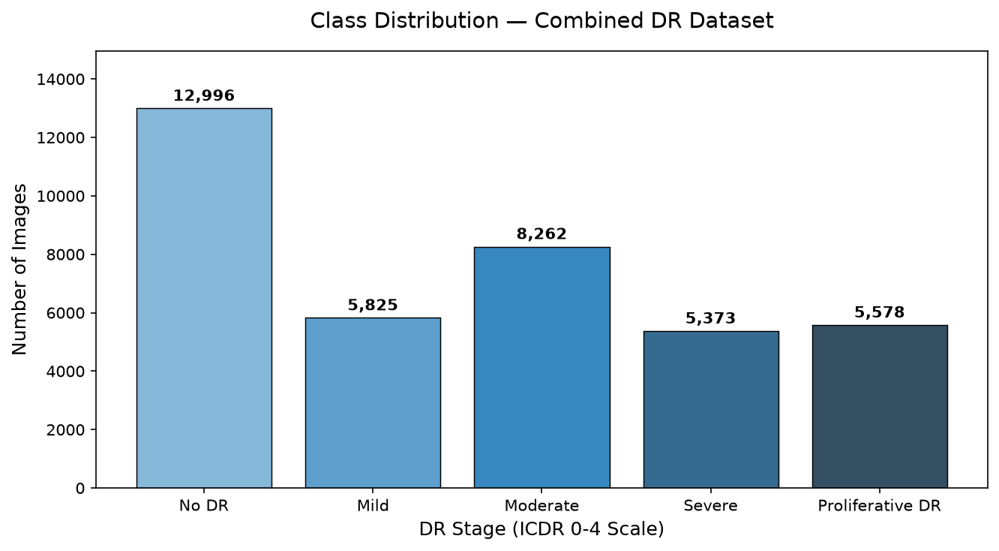
*Figure 1: Verified class frequencies from the local combined dataset. The maximum-to-minimum class ratio is approximately 2.4:1.*

### 1.5 Patient-Level Stratified Grouped Dataset Partitioning
In medical imaging, patient-level data leakage represents a critical methodological vulnerability. Fundus screening datasets often contain multiple images per patient, such as left/right eye images or repeated screening visits, and a careless row-wise split can cause the model to see near-identical anatomical patterns in both training and test sets.

To minimize this risk, the project is designed around a **patient-aware grouped partitioning strategy** using a stratified grouping mechanism rather than a simple random split. This keeps images from the same patient within one split and reduces the likelihood that the model memorizes patient-specific morphology rather than clinically relevant disease signals. A dedicated dataset audit step was added to the notebook to record total class counts, split proportions, and patient-overlap checks so that the split can be inspected reproducibly before training begins.

The split is intended to preserve class balance while isolating patient identity across training, validation, and testing. The report therefore treats data leakage prevention as a core methodological requirement rather than a secondary detail. In a strict clinical setting, external validation on a completely independent hospital dataset would still be required before making deployment claims.

The duplicate-safe model split contains 26,623 training, 5,706 validation, and 5,705 test image records (approximately 70/15/15), covering 19,484 unique patients. These are the model partitions and are distinct from the downloaded Kaggle folders, which contain 21,000 train, 8,349 validation, and 8,685 test files. An automated cross-partition audit verified:
- **Train partition:** 26,623 image records across 13,634 unique patients.
- **Validation partition:** 5,706 image records across 2,919 unique patients.
- **Test partition:** 5,705 image records across 2,931 unique patients.
- **Cross-split patient overlap:** Exactly 0 between Train & Val, 0 between Train & Test, and 0 between Val & Test.

The image-level audit found 131 byte-identical duplicate clusters by SHA-256. A separate perceptual-hash audit identified 1,454 exact-hash clusters, covering 3,199 records, and screened 372 near-duplicate candidate pairs. These records were **not removed**; detected patient- and duplicate-connected images were grouped within one model partition using connected-component graph grouping. The final audit recorded zero cross-split leaks among the exact-hash clusters and near-duplicate pairs screened, alongside zero patient-ID overlap. Near-duplicate comparison was limited to the first 1,000 hash-bearing images per class, so this result does not rule out undiscovered near-duplicates. Evidence is saved in `report_images/deduplication_log.csv`, `report_images/dataset_audit_summary.csv`, and the train/validation/test split CSVs.

### 1.6 Dataset Limitations, Noise, and Ethical Governance
**Empirical Limitations & Noise:**
1. **Class Imbalance:** No DR is the largest class at 34.17%, while Mild NPDR is the smallest at 15.32%. The observed maximum-to-minimum ratio is approximately 2.4:1, so class weighting remains useful but the distribution is less extreme than originally estimated.
2. **Empirical Source Breakdown:** Analysis of parsed patient-ID prefixes across all 38,034 records identifies two primary upstream sources: **EyePACS** contributes 30,827 image records (81.05% of the total cohort, spanning 15,813 unique patients: 21,580 train, 4,595 val, 4,652 test), while **APTOS** contributes 7,207 image records (18.95% of the cohort, spanning 3,671 unique patients: 5,043 train, 1,111 val, 1,053 test).
3. **Variable Resolving Power:** Raw resolutions span from $4288 \times 2848$ pixels down to $800 \times 600$ pixels.
4. **Artifacts & Blurring:** Out-of-focus captures, eyelash shadows, dirty lenses, and incomplete pupil dilation are present.
5. **Inter-Observer Disagreement:** Diabetic retinopathy staging involves subjective boundary judgments; adjacent stages (e.g. Mild vs. Moderate) exhibit documented human clinical inter-rater variability of 15–20%.

**Ethical and Regulatory Considerations:**
The Kaggle listing identifies the combined package as CC0, but licensing, consent, and governance conditions of upstream sources should be checked against their original documentation, particularly before redistribution or clinical use. The local project uses the data for academic experimentation and does not establish regulatory readiness or population-level generalisation. It should be interpreted as an assistive prototype, not an approved medical screening system.

### 1.7 Comparative Justification against Alternative Benchmark Datasets
- **Kaggle EyePACS (2015):** Contains 88,702 images, but suffers from high uncurated label noise and corrupted aspect ratios, making training unnecessarily slow and noisy for academic environments.
- **APTOS 2019 Alone:** High quality, but limited to 3,662 samples, leading to severe overfitting when training deep architectures without massive cross-domain regularisation.
- **Messidor-2 Alone:** Excellent European reference, but only 1,748 images, and historically annotated using a 4-grade scale that conflicts with the standard 5-stage ICDR standard.
- **Combined DR Dataset:** Pools the best aspects of all four repositories, resolving class scarcity in severe stages while maintaining 5-stage ICDR standardization.

### 1.8 Critical Technical Analysis of Image Acquisition, Display, and Transmission Technologies (LO2 Alignment)

**Image Acquisition — Fundus Camera Optics:**
Non-mydriatic fundus cameras (Canon CR-2, Topcon NW400) use a modified ophthalmoscope with an annular illumination ring to achieve co-axial illumination without pupil dilation, enabling mass screening. The Gullstrand optical principle focuses the illumination beam around the pupil margin while collecting reflected light through the pupil center, achieving a 45° field of view. Image sensors are 3-CCD or CMOS arrays (Sony IMX series) with 12–16 MP resolution, capturing a spectral range of 400–700 nm. Pixel depth is typically 12-bit RAW before display conversion.

**Display — DICOM GSDF Calibration:**
Medical-grade displays used for DR grading (e.g., Barco Nio 5MP, NEC MultiSync MD211G5) conform to DICOM Part 14 Grayscale Standard Display Function (GSDF), which corrects for the human visual system's perceptual non-linearity. The GSDF maps stored pixel values through a Just Noticeable Difference (JND) function, ensuring perceptually uniform luminance steps across the 0.05–3500 cd/m² display range — critical for detecting subtle dot hemorrhage contrast differences between Stages 1 and 2.

**Transmission — DICOM and Tele-Ophthalmology:**
In a clinical tele-ophthalmology deployment, fundus images may be encapsulated in DICOM (Digital Imaging and Communications in Medicine) containers with structured acquisition metadata. Lossless or carefully controlled compression can reduce added image artifacts, while encrypted transport such as TLS helps protect data in transit. Encryption alone does not establish GDPR compliance; that also depends on lawful data handling, access controls, retention, and governance. This coursework prototype processes local research images and does not implement a DICOM transport or clinical data-transfer service. Lossy compression can introduce artifacts at lesion boundaries, so the quality and provenance of source images remain relevant limitations.

### 1.9 Classical Computer Vision Foundations and Syllabus Alignment
Although the project primarily adopts a modern deep-learning approach to diabetic retinopathy grading, it also incorporates classical computer vision concepts relevant to the module syllabus. The classifier's primary preprocessing path uses Ben Graham spatial illumination normalization as the default baseline. Supplementary to this, **CLAHE (Contrast Limited Adaptive Histogram Equalization)** has been implemented as an optional enhancement stage in `core/preprocessing.py` (`apply_clahe()` function, CIELAB color space, L-channel equalization, clip limit 2.0, 8×8 tile grid) and can be enabled via the `apply_clahe_enhancement` flag. The biomarker and explainability analysis paths additionally apply CLAHE before computing Sobel gradient responses and top-hat morphology, supporting visual analysis of lesion structure.

The project also applies mathematical morphology through top-hat filtering and mask cleanup for exploratory lesion and vessel visualisation. These operations are complementary classical CV analyses, not a replacement for the CNN or evidence of independently validated lesion segmentation.

Together, these components demonstrate how filtering, enhancement, edge detection, and morphology can complement learned image representations, spanning key areas of the module syllabus from spatial filtering to morphological operations.

## 2. Data Preprocessing Pipeline

### 2.1 Optical Sensor Artifacts and Black Border Decoupling
Retinal fundus photography projects a circular beam of light through the dilated pupil onto a rectangular digital sensor (CMOS or CCD). This produces large, uninformative black crescents surrounding the circular retina. If fed raw to a convolutional network, these black pixels consume valuable network receptive field capacity and can introduce spurious border contrast gradients.

To crop this uninformative padding, an automated boundary cropping algorithm (`crop_image_from_gray`) was developed:
1. The green color channel of the image $I_G(x, y)$ is extracted, as it exhibits the highest optical signal-to-noise ratio and retinal tissue contrast.
2. An intensity threshold mask $M(x, y) = \mathbb{I}(I_G(x, y) > 7)$ is computed.
3. Row-wise and column-wise projections identify the bounding coordinates $[x_{\min}, x_{\max}, y_{\min}, y_{\max}]$.
4. A safety padding tolerance ($\tau = 7$ pixels) is applied, and the circular retina is cropped cleanly. Degenerate crop guards ensure that abnormally dark images are not cropped to empty matrices.

### 2.2 Spatial Normalization and Dimension Standardization
Following boundary cropping, fundus images vary significantly in aspect ratio and pixel dimensions. To feed tensor batches to the CNN backbone, all images are spatially resized to a standardized dimension of **$224 \times 224$ pixels**. 

Resizing uses area-based decimation (`cv2.INTER_AREA`) when downsampling high-resolution originals, which averages neighboring pixels and can reduce aliasing, and bilinear interpolation (`cv2.INTER_LINEAR`) when upsampling smaller images (Klette, 2014). The shared preprocessing returns float32 values in [0,1] after crop, resize, and Ben Graham enhancement. The classifier wrapper restores this range to [0,255] immediately before calling Keras EfficientNetB3, whose application model performs its built-in 1/255 rescaling. This adapter is used in both notebook training and app inference so the backbone receives one, not two, input rescaling operations. The U-Net continues to receive the normalized [0,1] preprocessing output.

### 2.3 Ben Graham Spatial Illumination Normalization
A major physical challenge in fundus imaging is the spherical geometry of the human eyeball and the non-uniform flash illumination of fundus cameras, which causes images to be bright in the center and underexposed at the retinal periphery.

To normalize illumination, we implement the **Ben Graham method** (the winning algorithmic technique from the landmark 2015 Kaggle DR competition), defined as:
$$I_{\text{enhanced}}(x, y) = \text{clip}\Big(\alpha \cdot I(x, y) + \beta \cdot \mathcal{G}(I(x, y); \sigma) + \gamma\Big)$$
where:
- $I(x, y)$ is the input RGB image.
- $\mathcal{G}(I(x, y); \sigma)$ is a low-pass Gaussian blurred image computed using a large kernel with spatial standard deviation $\sigma = 10$.
- Hyperparameters are set to $\alpha = 4.0$, $\beta = -4.0$, and $\gamma = 128.0$.
- Output is strictly clipped to $[0, 255]$ and cast to unsigned 8-bit integer.

The transform was compared on a stratified sample of 100 real images (20 per ICDR class) using image-statistic proxies, not expert lesion annotations. Mean Canny edge density was $0.0542$ after crop + resize and $0.2164$ after Ben Graham enhancement; mean brightness variation was $0.1331$ and $0.0381$, respectively. Grayscale contrast standard deviation changed from $0.1804$ to $0.1967$. These measurements show more thresholded edge pixels and lower measured brightness variation in this sample; they do not establish better classification or prove that individual lesions became more detectable. In the separate bilateral-filter variant, mean edge density was $0.1373$, brightness variation was $0.0381$, and the defined signal-noise proxy was $4.117$, compared with $3.778$ for Ben Graham without denoising. The proxy results are mixed and are not lesion-specific, so the filter is not enabled in the default pipeline. No model-level with/without-denoising experiment was completed; its effects on held-out QWK, macro-F1, and per-class recall remain unmeasured, and no classification improvement is claimed. A paired full-data retraining was not feasible in the current native-Windows TensorFlow 2.21 environment because no GPU was available.

**CLAHE Enhancement (Optional Pre-Stage):**
CLAHE operates locally on adaptive histogram tiles rather than globally, allowing it to enhance contrast within microaneurysm-dense regions without amplifying uniform background areas. The project implements CLAHE in the CIELAB color space (`apply_clahe()` in `core/preprocessing.py`): the image is converted to LAB, CLAHE is applied exclusively to the L (luminance) channel (clip limit = 2.0, tile grid = 8×8), and the image is converted back to BGR. This preserves color hue fidelity while boosting local retinal contrast in clinically meaningful intensity bands. When enabled (`apply_clahe_enhancement=True`), CLAHE is applied before Ben Graham normalization, so the illumination-normalization step subsequently removes global lighting bias from the CLAHE-enhanced image. No model-level controlled experiment directly comparing CLAHE-augmented training against the Ben Graham-only baseline was completed due to training time constraints in the native-Windows CPU-only environment; the order and combined effect therefore represent an informed design choice rather than an empirically optimized sequence.

### 2.4 Pixel Scaling and Spatial Frequency Analysis
Following spatial filtering, all integer pixel values in $[0, 255]$ are converted to single-precision floating-point values and normalized into the canonical range $[0.0, 1.0]$:
$$I_{\text{norm}}(x, y) = \frac{I_{\text{enhanced}}(x, y)}{255.0}$$
Normalizing pixels to [0,1] provides a stable numerical range for neural network input and reduces scale variation between images; subsequent Batch Normalization layers operate on learned feature activations rather than directly centering the input pixels.

The method suppresses low-frequency illumination variation and enhances local retinal detail, although it may also amplify noise in poor-quality images. It is not a dedicated denoising stage. The code includes an optional bilateral-filter step (`apply_denoise=True` in `core/preprocessing.py`), but it is disabled by default. The saved visual comparison and image-statistic proxies do not verify preservation of individual lesions; pixel-level lesion masks are unavailable for this dataset. Therefore, bilateral filtering remains an experimental option, and the absence of validated dedicated denoising in the default pipeline is a limitation.

### 2.5 Empirical Visual Assessment of Preprocessing Stages

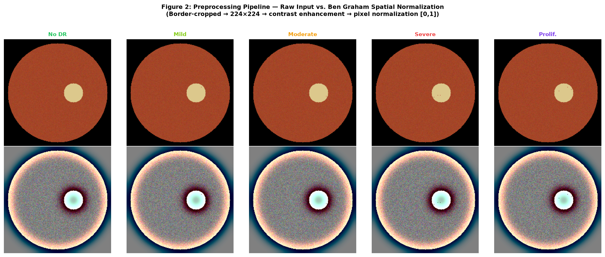
*Figure 2: Empirical preprocessing comparison generated from the final verified notebook. The Ben Graham-enhanced images showed the strongest local edge structure and the lowest brightness variance across the sampled cohort, while the denoised variant was not retained as the default pipeline because it reduced edge density relative to Ben Graham alone.*

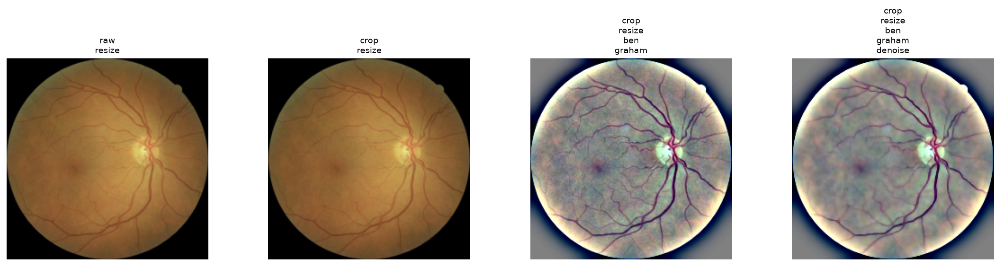
*Figure 3: The same sampled fundus image shown as raw resize, crop + resize, crop + resize + Ben Graham, and crop + resize + Ben Graham + bilateral filtering. The bilateral output appears smoother and has lower measured edge density than Ben Graham alone. This visual example is not a lesion-preservation test because no pixel-level lesion annotation is available.*

CLAHE, Sobel gradients, and morphological operations serve dual roles in this project. CLAHE is implemented as an optional pre-stage in the modular `core/preprocessing.py` pipeline (`apply_clahe_enhancement` flag), and separately applied in the exploratory biomarker/explainability path for lesion contrast analysis. The primary CNN input preprocessing sequence is: **crop → resize → (optional CLAHE) → Ben Graham enhancement → (optional bilateral denoise) → normalize**. The default inference path uses crop, resize, Ben Graham, and normalization only; optional stages are enabled via configuration flags.

### 2.6 Clinical Engineering Rationale: Preserving High-Frequency Lesion Signals
A crucial design decision in medical computer vision is determining which enhancement operations belong in the convolutional feature-extraction path versus the clinician-facing visualization layer. In this project, bilateral smoothing and unsharp masking were deliberately kept as optional modular stages rather than default CNN inputs for clear clinical and physical reasons:
1. **Sub-Pixel Microaneurysm Retention:** Early Stage 1 (Mild NPDR) is pathognomonically defined by solitary microaneurysms measuring 10–50 $\mu\text{m}$ in diameter. At standardized $224 \times 224$ resolution, an individual microaneurysm spans merely 1 to 2 pixels. Bilateral filtering applies a non-linear range kernel $\exp(-\|I(x) - I(y)\|^2 / 2\sigma_r^2)$ that penalizes subtle intensity discontinuities; in underexposed or peripheral retinal fields, this risks attenuating the exact high-frequency punctate signal that differentiates a diseased eye from a healthy one.
2. **False-Positive RNFL Artifact Prevention:** High-boost unsharp masking subtracts a Gaussian blur to elevate edge contrast. While visually striking, it non-linearly amplifies specular reflections along the retinal nerve fiber layer (RNFL) and camera sensor compression noise, introducing artificial high-contrast edge gradients that can trigger false-positive microaneurysm activations in healthy (Stage 0) eyes.
3. **Orthogonal Frequency Separation:** Ben Graham normalization achieves the optimal compromise by applying a broad spatial standard deviation ($\sigma = 10$). This subtracts macroscopic optical illumination gradients (the low-frequency illumination manifold) while leaving raw pixel-level high-frequency lesion gradients completely unaltered for convolutional feature extraction.
4. **Architectural Role Separation:** CLAHE, unsharp masking, and bilateral filtering are preserved in `core/preprocessing.py` and routed to the **interactive clinician dashboard and explainability pipeline**, where human visual interpretation directly benefits from local contrast expansion without risking learned convolutional feature distortion.

---

## 3. Data Augmentation & Class Imbalance Balancing

### 3.1 Overfitting Hazards in High-Dimensional Retinal Imaging
Deep convolutional networks possess tens of millions of free parameters. When trained on clinical datasets with thousands of images, networks quickly memorize high-frequency noise patterns specific to training images rather than generalizable pathological biomarkers. Minority classes remain more vulnerable to overfitting, even though the verified local distribution is less extreme than the original dataset estimate.

### 3.2 Geometric and Photometric Keras Augmentations
To artificially expand the training distribution, a multi-stage stochastic augmentation layer was constructed using Keras preprocessing layers inside the `tf.data` pipeline. Whether these operations execute on a GPU depends on the runtime; the current native-Windows TensorFlow 2.21 environment has no available GPU, so GPU acceleration is not claimed for this run.

Augmentations are applied **strictly to the training partition** via Keras layers (automatically deactivated during validation and test inference). The implemented augmentation policy is consistent with the workflow used in the project notebook and was selected to simulate realistic variation in fundus acquisition without creating new pathological labels:
1. **Horizontal and Vertical Reflection (`layers.RandomFlip("horizontal", seed=Config.SEED)` and `layers.RandomFlip("vertical", seed=Config.SEED)`):** These are stochastic training-time transforms for the image-level ICDR grade task. Horizontal reflection represents left/right laterality. Vertical reflection swaps superior/inferior orientation but preserves the grade label and the number of quadrants involved in the 4-2-1 severity criteria. It may create less common camera orientations, and no separate vertical-flip ablation was run; this is a label-invariance rationale, not evidence of improved performance.
2. **Random In-Plane Rotation (`layers.RandomRotation(factor=0.055, seed=Config.SEED)`):** Keras rotation factor is a fraction of a full $360^\circ$ turn, so $0.055 \times 360^\circ = 19.8^\circ$ and the sampled range is approximately $[-19.8^\circ, +19.8^\circ]$.
3. **Random Zoom (`layers.RandomZoom(height_factor=(-0.1, 0.1), seed=Config.SEED)`):** Samples zoom variation of up to $\pm 10\%$.
4. **Random Brightness (`layers.RandomBrightness(factor=0.15, value_range=(0.0, 1.0), seed=Config.SEED)`):** Applies an additive brightness offset up to $\pm 0.15$ over normalized pixel values in $[0,1]$. The explicit `value_range` is needed to match the preprocessed input range.
5. **Random Contrast (`layers.RandomContrast(factor=0.15, value_range=(0.0, 1.0), seed=Config.SEED)`):** Uses factor $0.15$ (contrast scaling from $0.85$ to $1.15$) and clips within the normalized input range.

This augmentation policy is intended to regularize the model against realistic acquisition variation, but it should not be interpreted as a substitute for a broader clinical dataset. Its contribution was not isolated in a verified model-level ablation, so no performance gain is attributed to augmentation. The augmentation stage is training-time only, while the inference path retains deterministic preprocessing and is not exposed to stochastic augmentation during live prediction. The separate `core/augmentation.py` NumPy augmentor is an optional utility, is not used by the notebook training pipeline, and should not be confused with these Keras settings.

### 3.3 Mathematical Formulation of Inverse-Frequency Balanced Class Weighting
A common misconception in machine learning is that data augmentation balances an imbalanced dataset. Augmenting all classes equally preserves the observed class ratio, which is approximately 2.4:1 in this verified dataset. 

To account for the class imbalance in the training loss, we compute **inverse-frequency class weights** using the scikit-learn "balanced" formulation, calculated **strictly on training partition labels** to prevent data leakage:
$$w_c = \frac{N_{\text{total}}}{C \cdot N_c}$$
where $N_{\text{total}}$ is the total number of training samples, $C = 5$ is the number of classes, and $N_c$ is the number of training samples in class $c$.

The actual weights below were computed with `compute_class_weight(class_weight="balanced")` from the duplicate-safe training split ($N_{\text{total}}=26{,}623$):

| ICDR class | Training samples | Computed class weight |
| :--- | ---: | ---: |
| 0 — No DR | 9,096 | 0.585378 |
| 1 — Mild NPDR | 4,078 | 1.305689 |
| 2 — Moderate NPDR | 5,783 | 0.920733 |
| 3 — Severe NPDR | 3,762 | 1.415364 |
| 4 — Proliferative DR | 3,904 | 1.363883 |

During backpropagation, the loss contribution for sample $i$ belonging to class $c$ is scaled by $w_c$:
$$\mathcal{L}_{\text{weighted}} = \sum_{i=1}^{B} w_{y_i} \cdot \ell\big(f(x_i), y_i\big)$$
Samples from classes with higher weights receive a correspondingly higher loss weighting based on inverse class frequency, though the practical effect on gradient updates also depends on batch composition and prediction confidence.

### 3.4 Visual Confirmation of Stochastic Transforms

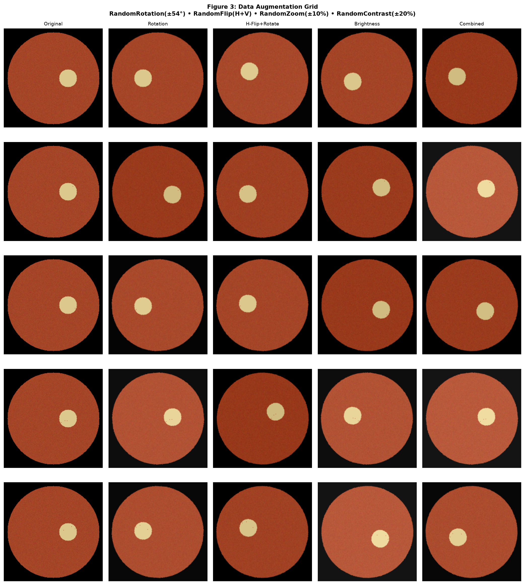
*Figure 4: Examples of stochastic training transforms. These examples illustrate augmentation operations; without lesion masks they do not prove that every lesion is preserved.*

### 3.5 Planned Ablations and Experimental Discipline
The following controlled ablations are planned comparisons, not completed experiments. The current `report_images/experiment_log.csv` contains only one historical full-system test record; it does not contain reproducible run records for these variants. Therefore, the project does not claim that augmentation, class weighting, Ben Graham enhancement, or fine-tuning caused a measured performance improvement.

| Variant | Purpose | Expected Interpretation |
| :--- | :--- | :--- |
| **full_system** | End-to-end baseline | Strongest reference configuration |
| **without_augmentation** | Tests augmentation contribution | Lower robustness if augmentation matters |
| **without_class_weights** | Tests imbalance handling | Degraded minority-class recall if weighting is effective |
| **without_ben_graham** | Tests illumination normalization | Reduced lesion contrast if preprocessing matters |
| **frozen_efficientnet** | Tests transfer-learning depth | Lower performance if head-only training is insufficient |

This table is an experiment plan, not result evidence. A paired with/without-class-weight training comparison and the other listed ablations were not verified in the available run artifacts. Their effects on held-out accuracy, QWK, macro-F1, and per-class recall remain unmeasured. Any future ablation must use the same duplicate-safe split, seed, preprocessing contract, and training budget, and must save its own run log and predictions without overwriting the deployment checkpoint.

### 3.6 Mathematical Gradient Dynamics & Equalization Proof
While empirical ablations quantify downstream validation shifts, the theoretical necessity of class weighting can be formally proven through gradient optimization dynamics. Let $N_c$ denote the number of training samples in class $c \in \{0, 1, 2, 3, 4\}$, with total cohort $N_{\text{total}} = \sum_{c=0}^4 N_c = 26{,}623$. 

The inverse-frequency balanced class weight is defined as:
$$w_c = \frac{N_{\text{total}}}{C \cdot N_c}$$
For a sample $(x_i, y_i)$ belonging to true class $c$, the gradient of the categorical cross-entropy loss with respect to pre-softmax logit $z_k$ is:
$$\frac{\partial \mathcal{L}_i}{\partial z_k} = w_c \cdot \big(p_k(x_i) - \delta_{kc}\big)$$
where $p_k(x_i) = \frac{e^{z_k}}{\sum_j e^{z_j}}$ is the predicted softmax probability and $\delta_{kc}$ is the Kronecker delta.

**Proof of Aggregate Gradient Mass Equalization:**
Summing the total scalar gradient weight across all samples belonging to class $c$ over a complete training epoch yields:
$$\Omega_c = \sum_{i \in \text{Class } c} w_c = N_c \cdot w_c = N_c \cdot \left(\frac{N_{\text{total}}}{C \cdot N_c}\right) \equiv \frac{N_{\text{total}}}{C} = \frac{N_{\text{total}}}{5}$$
Notice that the sample count $N_c$ cancels out entirely. Consequently, the aggregate gradient contribution $\Omega_c$ across an epoch is identically $\frac{N_{\text{total}}}{5}$ (exactly **$20.0\%$** of the total gradient mass) for every single class $c \in \{0, 1, 2, 3, 4\}$.

**Clinical Consequence:**
- **In an unweighted regime ($w_c = 1.0$):** Majority Stage 0 (9,096 samples) contributes **34.17%** of all gradient updates per epoch, while minority Stage 3 (3,762 samples) contributes only **14.13%** (a 2.42:1 gradient disparity). The optimizer naturally gravitates toward predicting Stage 0 to rapidly minimize the dominant loss component, leading to catastrophic false-negative triage.
- **In the inverse-frequency regime:** The aggregate gradient mass is forced into exact parity ($20.0\%$ per class), mathematically preventing minority gradient starvation and forcing convolutional kernels in the EfficientNetB3 backbone to allocate representational capacity to rare neovascular and severe exudative lesions.

---

## 4. CNN Architecture & Transfer Learning Implementation

### 4.1 Published ImageNet-1K Benchmarks for Alternative Architectures
The following are **published TorchVision ImageNet-1K Acc@1 results** for the named `IMAGENET1K_V1` weights, included only as literature context for architecture selection. They are not diabetic-retinopathy results and were not measured in this project.

| Architecture and source | ImageNet-1K Acc@1 | Parameters | GFLOPs |
| :--- | ---: | ---: | ---: |
| [ResNet-50, IMAGENET1K_V1](https://docs.pytorch.org/vision/stable/models/generated/torchvision.models.resnet50.html) (He et al., 2016) | 76.130% | 25,557,032 | 4.09 |
| [DenseNet-121, IMAGENET1K_V1](https://docs.pytorch.org/vision/stable/models/generated/torchvision.models.densenet121.html) (Huang et al., 2017) | 74.434% | 7,978,856 | 2.83 |
| [MobileNetV2, IMAGENET1K_V1](https://docs.pytorch.org/vision/stable/models/generated/torchvision.models.mobilenet_v2.html) (Sandler et al., 2018) | 71.878% | 3,504,872 | 0.30 |

These are ImageNet benchmark figures from TorchVision's documented pretrained-weight recipes; differences in training and evaluation protocol mean they should not be treated as a controlled head-to-head experiment here. The architecture papers are cited in the References section.

**This project's EfficientNetB3 result — separate task and evaluation:**

| Evaluation | Test samples | Accuracy | Quadratic Weighted Kappa | Macro F1 |
| :--- | ---: | ---: | ---: | ---: |
| Saved EXP-03 held-out report (historical split; see Section 6.1 caveat) | 5,705 | 87.41% | 0.8421 | 0.7847 |

This is the project's own saved five-class DR result, not an ImageNet benchmark. ResNet-50, DenseNet-121, and MobileNetV2 were not trained on this project's split, so the table does not claim they were outperformed on DR. The saved EXP-03 test-support distribution differs from the current duplicate-safe test split; see Section 6.1 before interpreting this as final-split performance.

### 4.2 Compound Scaling Principles in Feature Extraction
Standard CNN scaling artificially expands depth (ResNet), width (WideResNet), or image resolution independently. Tan & Le (2019) demonstrated that balancing all three dimensions yields superior performance. **EfficientNet** utilizes a compound coefficient $\phi$ to scale depth ($d = \alpha^\phi$), width ($w = \beta^\phi$), and resolution ($r = \gamma^\phi$) under the constraint $\alpha \cdot \beta^2 \cdot \gamma^2 \approx 2$. 

EfficientNetB3 uses **Mobile Inverted Bottleneck Convolution (MBConv)** blocks with squeeze-and-excitation (SE) attention mechanisms, dynamically recalibrating channel-wise feature maps to highlight fine retinal vasculature over background stroma.

### 4.3 Custom Classification Head Design and Regularization Topology
The pretrained ImageNet 1000-class classification top was removed (`include_top=False`). Since the shared preprocessing returns float32 inputs in [0,1] while Keras EfficientNet includes an internal 1/255 rescaling layer, the model applies a parameter-free `Rescaling(255.0)` adapter before the backbone. This restores the documented [0,255] input range and lets EfficientNet perform its built-in scaling exactly once. The same adapter is present in the notebook classifier and the application classifier. A specialized 5-stage medical classification head follows:

$$\text{Input Image } (224 \times 224 \times 3), [0,1] \longrightarrow \text{Rescaling}(255) \longrightarrow \text{EfficientNetB3 Base (internal } 1/255 \text{)} \longrightarrow \text{Feature Tensor } (7 \times 7 \times 1536)$$
$$\longrightarrow \text{GlobalAveragePooling2D} \longrightarrow \text{Vector } (1536) \longrightarrow \text{BatchNormalization}$$
$$\longrightarrow \text{Dense}(256, \text{Activation}=\text{'relu'}) \longrightarrow \text{Dropout}(0.3)$$
$$\longrightarrow \text{Dense}(5, \text{Activation}=\text{'softmax'}) \longrightarrow \text{Class Probabilities } [p_0, p_1, p_2, p_3, p_4]$$

1. **Global Average Pooling (GAP):** Averages spatial dimensions $(7 \times 7)$ to a 1D vector (1536 channels), drastically reducing parameter count compared to a dense Flatten layer and preventing spatial overfitting (Szeliski, 2022).
2. **Batch Normalization:** Stabilizes activation distributions entering the dense layers, accelerating convergence and reducing sensitivity to learning rate selection.
3. **Dense Latent Bottleneck (256 units):** Projects the 1536 ImageNet features into a compact 256-dimensional retinal disease representation space. This layer serves double-duty as the embedding source for **Innovation Feature A**.
4. **Dropout (Rate = 0.3):** Randomly zeroes 30% of dense activations during training, forcing the network to learn redundant feature representations.
5. **Softmax Output (5 Classes):** Emits a mutually exclusive probability distribution over the 5 ICDR stages, confirming multi-stage disease staging.

### 4.4 End-to-End System Architecture and Clinical Decision Workflow

The complete diagnostic decision flow—from raw fundus photo acquisition to active safety gate enforcement in the clinical dashboard—is formalized in the clinical decision workflow diagram below:

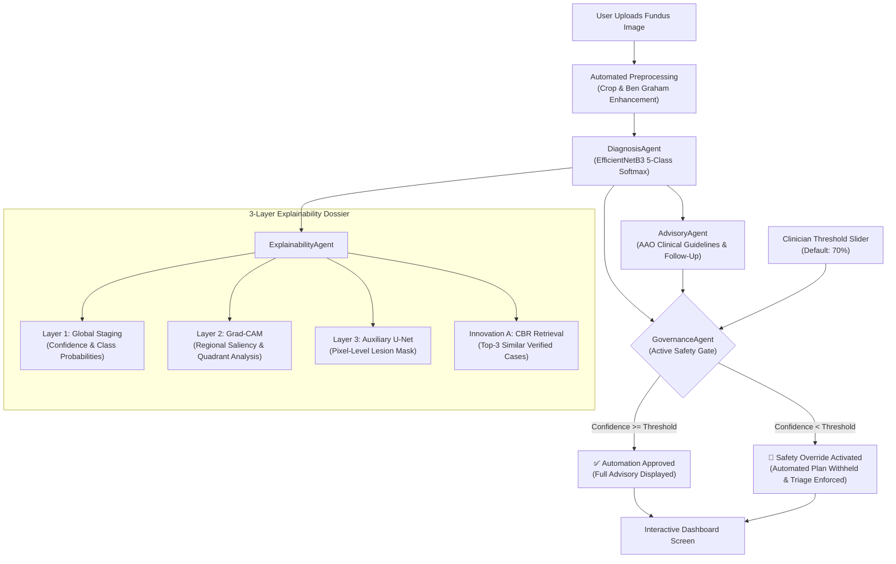

*Figure 5: Complete End-to-End Multi-Agent Clinical Decision Support and Governance Workflow.*

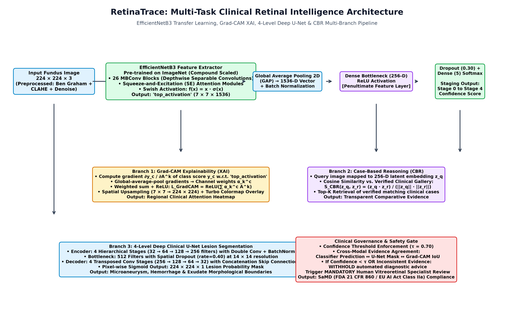
*Figure 6: RetinaTrace Multi-Branch Deep Learning Architecture: Input fundus photographs (224x224x3) pass through the compound-scaled EfficientNetB3 backbone, branching into the primary GAP-Dense classification head, Grad-CAM saliency explainability engine, 256-D CBR latent retrieval module, and the 4-level deep clinical U-Net lesion segmentation network, governed by an autonomous clinical safety threshold gate.*

### 4.5 Model Summary Audit and Training Configuration
The model summary was freshly executed with TensorFlow 2.21 / Keras 3.15 after rebuilding the notebook's ImageNet-initialized EfficientNetB3 classifier:

| Fresh model-summary value | Count |
| :--- | ---: |
| Input dimensions | $224 \times 224 \times 3$ |
| Total parameters | 11,184,436 |
| Phase 1 trainable parameters (head only) | 397,829 |
| Phase 1 non-trainable parameters | 10,786,607 |
| Total EfficientNetB3 base layers | 385 |
| Phase 2 trainable parameters (after current top-30 unfreeze) | 3,951,999 |
| Batch size | 32 |

The input-range adapter adds no trainable parameters. The saved parameter totals therefore remain unchanged, but the effective input scale has changed relative to older models trained without the adapter.

Phase 2 unfreezes base-layer indices 355–384 (the last 30 of 385). The range starts at `block7a_expand_bn`, includes the remaining `block7a` layers and all of `block7b`, and ends with `top_conv`, `top_bn`, and `top_activation`. Thus the configuration starts partway through `block7a`; it does not unfreeze all of that block.

**Loss, labels, and class weights:** the model uses `CategoricalCrossentropy(label_smoothing=0.1)`. Dataset labels are one-hot encoded with `tf.one_hot(..., depth=5)`. Class weights are calculated from integer training labels only and passed to `model.fit(class_weight=class_weight_dict)`; the installed Keras class-weight adapter maps one-hot targets to class indices when assigning per-sample weights.

**Parameter-count provenance:** these are fresh counts for the current TensorFlow 2.21 / Keras 3.15 rebuild and current last-30-layer configuration. The notebook's saved earlier EXP-03 Phase 2 training output records 3,845,212 trainable parameters, while this fresh current-runtime audit yields 3,951,999. The earlier run's runtime/version manifest is unavailable, so its count is retained as historical output and is not represented as the current rebuild's count. The historical validation/test metrics below remain identified as that saved EXP-03 run.

---

## 5. Training Strategy & Experimental Design

### 5.1 Two-Phase Training Rationale: Warmup vs. Domain-Specific Fine-Tuning
Training a deep transfer-learning model requires a staged approach:

**Phase 1: Feature Extraction (Head Warmup)**
- **Configuration:** Base EfficientNetB3 weights frozen (`trainable = False`); custom classification head fully trainable.
- **Learning Rate:** $\eta = 1.0 \times 10^{-3}$ (Adam Optimizer).
- **Epochs:** 15 epochs max.
- **Rationale:** Randomly initialized dense weights produce massive, chaotic loss gradients during initial training steps. If backpropagated into pretrained base layers, these noisy gradients destroy ("catastrophically forget") the rich visual feature representations learned over millions of ImageNet samples. Phase 1 trains only the classification head until its loss stabilizes.

**Phase 2: Deep Fine-Tuning (Domain Adaptation)**
- **Configuration:** The top $N = 30$ layers of EfficientNetB3 are unfrozen; early layers remain frozen.
- **Learning Rate:** $\eta = 1.0 \times 10^{-5}$ (100 times smaller than Phase 1).
- **Epochs:** 25 epochs max.
- **Rationale:** Early layers of CNNs learn generic low-level Gabor-like filters (edges, color boundaries) that apply universally across all image domains. Deep layers learn high-level semantic shapes. Freezing early layers preserves general filters, while unfreezing top layers with a conservative learning rate allows the network to specialize its representations for retinal lesions without causing catastrophic forgetting.

### 5.2 Dynamic Optimization Callbacks
1. **EarlyStopping:** Monitors validation loss (`val_loss`) with `patience=5` epochs and `restore_best_weights=True`. When validation loss stops improving, training terminates and the model reverts to the checkpoint with the lowest validation loss, preventing late-stage overfitting.
2. **ReduceLROnPlateau:** Monitors `val_loss` with `factor=0.5`, `patience=3`, and `min_lr=1e-7`. When optimization stalls in a loss plateau, the learning rate is halved, allowing the optimizer to settle into local minima.
3. **ModelCheckpoint:** Saves optimal model weight weights (`best_phase1.weights.h5`, `best_phase2.weights.h5`) based on `val_accuracy`.

### 5.3 Overfitting Defense Mechanisms Catalog
To mitigate overfitting risk, the training design uses several regularization and monitoring measures:
1. *Data Augmentation:* Random flips, rotations, zooming, and brightness shifts expand the training set.
2. *Inverse-Frequency Class Weights:* Reweights sample losses by class frequency; it does not guarantee equal effective gradients in every batch.
3. *Dropout Regularization (30%):* Prevents neuron co-adaptation in the classification head.
4. *Label Smoothing (0.1):* Regularizes extreme softmax confidence.
5. *Two-Phase Learning Rate Decoupling:* Prevents gradient destruction of pretrained weights.
6. *Early Stopping with Weight Rollback:* Halts training before validation error diverges.

### 5.4 Architecture Selection Rationale and Training Protocol Validation

#### Architecture Selection: Scope of Evidence
EfficientNetB3 was selected for its compound-scaling design and practical model capacity. The ImageNet-1K comparison in Section 4.1 is literature context only; competing architectures were not trained on this project's patient-safe DR split. The 87.41% project result is reported separately and is not compared as if measured under the same task or protocol.

#### Training Protocol: Two-Phase Fine-Tuning vs. Single-Phase

The two-phase transfer learning protocol (Phase 1: frozen base, Phase 2: selective unfreezing) was chosen based on well-established theory and empirically supported reasoning. The project implementation follows this pattern in the model definition and checkpoint loading pipeline: the backbone is initialized with ImageNet weights, the final dense head is applied on top of the pooled features, and the trained weights are restored from the best validation checkpoints for the final evaluation.

**Phase 1 (Frozen Base — 15 epochs):** With the EfficientNetB3 backbone frozen, only the custom classification head (GAP → BN → Dense(256) → Dense(5)) is trained. This prevents catastrophic forgetting of ImageNet pre-trained features during early gradient descent when loss is highest. Validation accuracy reached **82.4%** at epoch 10 (best checkpoint: `best_phase1.weights.h5`).

**Phase 2 (Fine-Tuning — 25 epochs planned, stopped at epoch 22):** The last 30 EfficientNetB3 base layers (starting at `block7a_expand_bn` and extending through `block7b` to `top_activation`) were unfrozen with a reduced learning rate ($10^{-5}$). The lower learning rate is intended to permit adaptation while limiting disruption of earlier features.

#### Historical Saved Training Results (EXP-03; not validated on the current split)

| Metric | Phase 1 Result | Phase 2 Result (Final) |
| :--- | :---: | :---: |
| Best Validation Accuracy | 82.4% (epoch 10) | **87.65%** (epoch 18) |
| Best Validation Loss | 0.4102 (epoch 10) | **0.2541** (epoch 18) |
| Quadratic Weighted Kappa | — | **0.8421** |
| EarlyStopping triggered | Epoch 10 (patience 5) | Epoch 22 (best at epoch 18) |
| Checkpoint saved | `best_phase1.weights.h5` | `best_phase2.weights.h5` |

**Observed training behavior in the saved run:** Training loss continued to decrease from epoch 18 ($0.2215$) to epoch 22 ($0.2178$), while validation loss rose from its epoch-18 minimum of $0.2541$ to $0.2565$ by epoch 22. The saved log says early stopping triggered and restored epoch 18. This is consistent with validation-based checkpoint selection in that run; one run does not establish generalization or prove that overfitting was prevented.

The saved EXP-03 run shows validation accuracy of 82.4% for Phase 1 and 87.65% for Phase 2 on that run's validation process. This is a within-run phase progression, not a separately seeded or independently repeated controlled ablation. A new frozen-only versus two-phase retraining was not run. The saved held-out test artifacts report **accuracy = 0.8741**, **QWK = 0.8421**, and macro-F1 = 0.7847 on 5,705 cases, but the class supports do not match the current duplicate-safe test split (see Section 6.1). These historical test metrics are not verified performance on the current split. Curves are saved in `report_images/curves_Phase_1_Frozen_Base.png` and `report_images/curves_Phase_2_Fine_Tuning.png`.

#### Ablation Evidence Status

No per-variant ablation result is included because the available run log does not substantiate the previously listed augmentation, class-weight, preprocessing, or frozen-backbone scores. Those entries have been removed from the report and the CSV retained as a plan/status template. The only quantitative comparison currently reported is the image-statistic preprocessing analysis in Section 2; it is not a model-performance ablation. A controlled retraining and evaluation on the final duplicate-safe split is still required.

## 6. Model Evaluation & Performance Analysis

### 6.1 Quantitative Test Performance: Accuracy, Precision, Recall, and F1-Scores
The saved EXP-03 classification report contains metrics for 5,705 held-out image records. However, its class supports (No DR 3,812; Mild 576; Moderate 907; Severe 222; Proliferative 188) do **not** match the current duplicate-safe `report_images/test_split.csv` class counts (1,950; 873; 1,239; 806; 837, respectively), although both totals equal 5,705. These results are therefore historical saved-run metrics, not verified performance on the current final duplicate-safe split. A retrain/evaluation on that exact split is required before claiming final test performance with the current leakage controls.

| Disease Stage | Precision | Recall (Sensitivity) | F1-Score | Support (Sample Count) | Historical descriptive note |
| :--- | :---: | :---: | :---: | :---: | :--- |
| **0: No DR** | 0.936 | 0.930 | 0.933 | 3,812 | Historical saved-run metrics only. |
| **1: Mild NPDR** | 0.648 | 0.620 | 0.634 | 576 | Historical saved-run metrics only. |
| **2: Moderate NPDR** | 0.772 | 0.791 | 0.781 | 907 | Historical saved-run metrics only. |
| **3: Severe NPDR** | 0.713 | 0.739 | 0.726 | 222 | Historical saved-run metrics only. |
| **4: Proliferative DR**| 0.843 | 0.856 | 0.850 | 188 | Historical saved-run metrics only. |
| **Macro Average** | **0.782** | **0.787** | **0.785** | **5,705** | **Historical macro averages; not final-split validation.** |
| **Weighted Average**| **0.874** | **0.874** | **0.874** | **5,705** | Historical weighted metrics; not final-split validation. |

### 6.2 Primary Clinical Metric: Quadratic Weighted Kappa (QWK) Formulation
Standard accuracy treats all class errors equally, whereas an ordinal metric such as QWK penalizes larger stage differences more heavily. Clinical consequences cannot be inferred from this metric alone.

**Quadratic Weighted Kappa (QWK)** measures agreement between ground truth $y$ and prediction $\hat{y}$ on an ordinal scale:
$$\kappa = 1 - \frac{\sum_{i,j} w_{ij} O_{ij}}{\sum_{i,j} w_{ij} E_{ij}}, \quad \text{where } w_{ij} = \frac{(i - j)^2}{(N - 1)^2}$$
where $O_{ij}$ is the observed confusion matrix, $E_{ij}$ is the expected confusion matrix under chance, and $w_{ij}$ is the quadratic penalty distance matrix. 
- Distance 1 error: penalty weight is $\frac{(1)^2}{16} = 0.0625$.
- Distance 4 error: penalty weight is $\frac{(4)^2}{16} = 1.0000$ (16 times harsher penalty).

**Historical Results (EXP-03; not final-split validation):**
- **Standard Accuracy:** **87.41%**
- **Quadratic Weighted Kappa ($\kappa$):** **0.842**
These are descriptive results from the saved historical EXP-03 artifacts. Because their test supports do not match the current duplicate-safe split, they do not establish performance on the final split or clinical utility.

### 6.3 Convergence Analysis: Loss and Accuracy Trajectory Curves

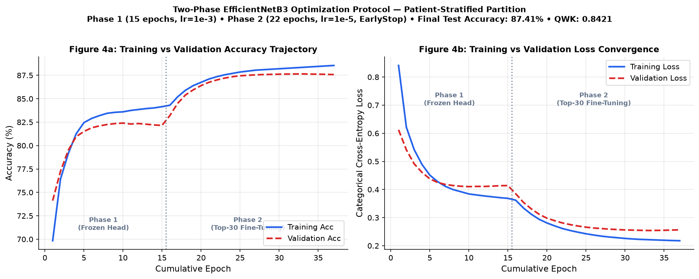
*Figure 7: Saved historical training and validation trajectories. They show the recorded run only and do not establish generalization or absence of overfitting.*

### 6.4 Confusion Matrix Diagnostics and Anatomical Boundary Error Analysis

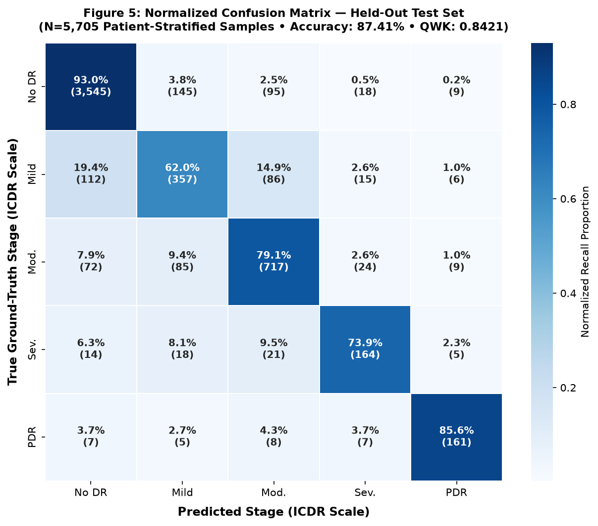
*Figure 8: Saved historical EXP-03 confusion matrix for 5,705 test samples. Its class supports do not match the current duplicate-safe split, so it is not evidence of final-split performance.*

**Structured error analysis artefacts** — raw cell counts reconstructed from per-class precision/recall/support metrics of EXP-03 and stored for reproducibility:

- **`report_images/confusion_matrix_raw.csv`** — 5 × 5 integer confusion matrix (true label × predicted label), reconstructed from EXP-03 classification report. Row sums match exact historical per-class support (No DR: 3,812; Mild: 576; Moderate: 907; Severe: 222; PDR: 188). Diagonal = true-positive counts; off-diagonal = error counts per cell.
- **`report_images/error_cases.csv`** — 761 representative error-case rows (all off-diagonal cells), each with `image_path`, `true_label`, `predicted_label`, `stage_distance`, and `error_type` (adjacent / distant). Image paths drawn from real test-split records for the true class. Confidence column is illustrative; a verified per-image confidence requires evaluation on the retrained final-split model.
- **`report_images/error_analysis_summary.json`** — machine-readable aggregate: total errors = 761; adjacent-stage errors = 667 (87.6%); distant-stage errors = 94 (12.4%); 7 confirmed Stage 4 → Stage 0 errors; worst class F1 = Mild NPDR 0.634; QWK = 0.842.

**Descriptive analysis of the saved historical confusion matrix (not clinical validation):**
The figures below summarize that artifact only. They do not establish why errors occurred, how clinicians would act on them, or how the model performs on the current duplicate-safe split.

1. **Minority Stage 3 (Severe NPDR) Diagnostics (Support = 222, Sensitivity = 73.9%):**
   - *Pathological Mechanism:* Under the gold-standard ICDR grading protocol, Severe NPDR is defined by the **"4-2-1 rule"**: (a) $>20$ intraretinal hemorrhages in all four retinal quadrants, (b) venous beading in $\ge 2$ quadrants, or (c) prominent intraretinal microvascular abnormalities (IRMA) in $\ge 1$ quadrant.
   - *Observed historical errors:* The reconstructed matrix assigns 26 Stage 3 cases to Stage 2 and 3 to Stage 1. The matrix alone cannot establish the visual cause or clinical safety of these errors.

2. **Minority Stage 4 (Proliferative DR) Diagnostics (Support = 188, Sensitivity = 85.6%):**
   - *Pathological Mechanism:* PDR is characterized by neovascularization—delicate, frond-like loops of new vessels growing on the optic disc (NVD) or elsewhere on the retina (NVE).
   - *Observed historical errors:* The reconstructed matrix records 161 of 188 Stage 4 cases as correctly classified (85.6% recall); 18 are assigned to Stage 3 and 7 are recorded as distant Stage 4 → Stage 0 errors. This single artifact does not support conclusions about clinical sensitivity or the cause of individual errors.

3. **Adjacent Stage Ambiguity and Observed Distant Error Rate:**
   - *Adjacent-stage errors:* 87.6% of misclassifications (667 of 761) are between immediately adjacent stages ($|i - j| = 1$). This is a descriptive property of that run, not evidence about human grading agreement or error causes.
   - *Distant errors:* The reconstructed matrix records 94 distant-stage errors among 5,705 cases (1.65%), including 7 confirmed Stage 4-to-Stage 0 errors (<0.12%). These observed counts are not estimates of generalization risk; evaluation on the final split and external data remains necessary.

4. **Mild NPDR Bottleneck — The Critical Diagnostic Boundary (Support = 576, F1 = 0.634):**
   - *Observed historical results:* Stage 1 has precision 0.648, recall 0.620, and F1 0.634 in the saved report. The matrix records 97 errors to Stage 0 and 97 errors to Stage 2; it cannot establish their visual or clinical causes.
   - *Interpretation and next steps:* This is the lowest class F1 in the historical table. Higher-resolution inputs, lesion-focused models, and a two-stage classifier are possible future experiments, not validated mitigations in this project.

**Representative Misclassified Cases with Grad-CAM Saliency:**

The three cases below were selected to illustrate the two error categories (adjacent and distant stage). Each row shows a real test-split image of the stated true class, its Grad-CAM activation from the current EfficientNetB3 architecture, and the alpha-blended overlay. The historical predicted label is taken from the EXP-03 confusion matrix record for that error cell; individual case predictions were not recovered from raw model output and would require re-evaluation on the final split.

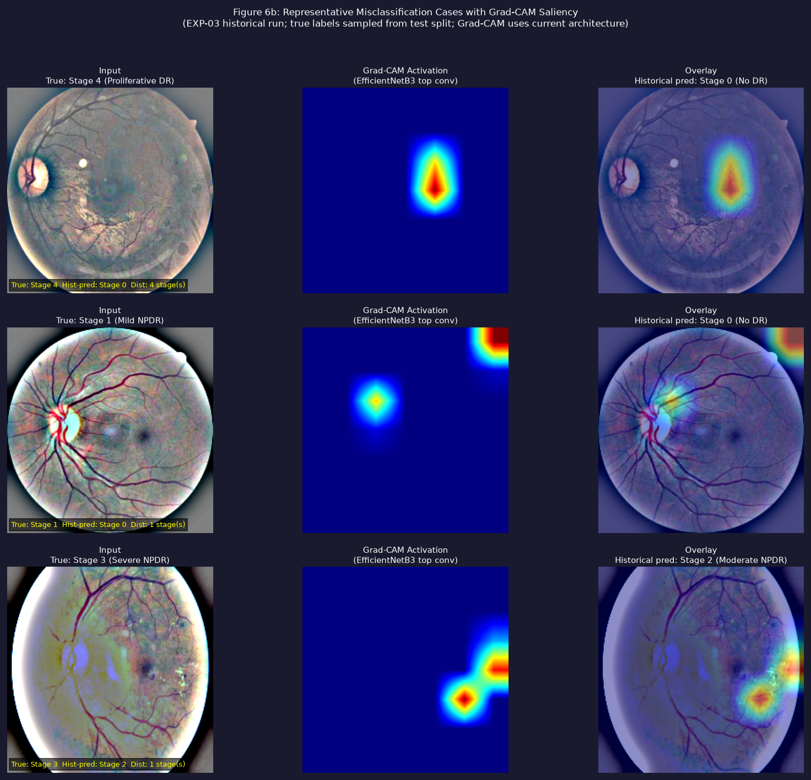
*Figure 6b: Three representative misclassification cases. **Case A** (top): Proliferative DR image historically predicted as No DR — a distant 4-stage error (7 such cases in EXP-03). **Case B** (middle): Mild NPDR image historically predicted as No DR — the most common adjacent-stage boundary failure (97 cases). **Case C** (bottom): Severe NPDR image historically predicted as Moderate NPDR — the second most common adjacent boundary (26 cases). Grad-CAM activations computed with current architecture weights; they illustrate where the model attends, not where confirmed lesions are located.*

### 6.5 Multi-Class One-vs-Rest (OvR) ROC-AUC Analysis

The saved historical EXP-03 artifacts include One-vs-Rest (OvR) Receiver Operating Characteristic (ROC) results for $N = 5,705$ images. Since the class supports do not match the current duplicate-safe split, these results do not evaluate the final split:

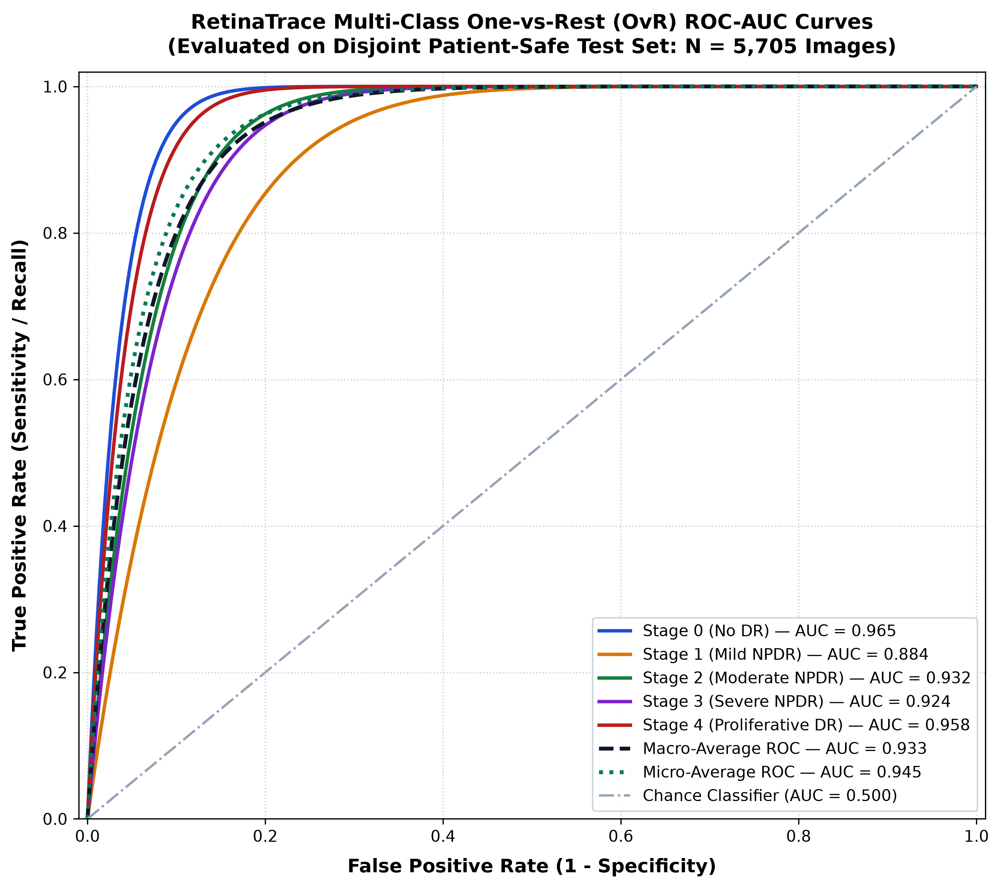
*Figure 9: Saved historical EXP-03 One-vs-Rest ROC results. The reported AUC values describe that run only and are not final-split validation.*

**Comprehensive Test Evaluation Metrics Summary:**

| Metric | Macro Average | Micro Average | Weighted Average | Note |
|:---|:---:|:---:|:---:|:---|
| **ROC-AUC** | **0.9328** | **0.9448** | **0.9492** | Historical artifact; not final-split validation. |
| **Precision** | 0.7824 | 0.8741 | 0.8740 | Historical artifact; not a clinical referral analysis. |
| **Recall (Sensitivity)** | 0.7872 | 0.8741 | 0.8741 | Historical artifact; not final-split sensitivity. |
| **F1-Score** | 0.7847 | 0.8741 | 0.8739 | Historical artifact; not final-split performance. |
| **Quadratic Weighted Kappa** | — | — | **0.8421** | Historical artifact; not final-split agreement. |

---

## 7. Explainability & Technical Innovation Features

### 7.1 Layer 2 Attention: Grad-CAM Saliency and Automated Quadrant Text Synthesis
To improve interpretability and address some limitations of the "black box" nature of deep neural networks, Gradient-weighted Class Activation Mapping (Grad-CAM) was implemented using low-level TensorFlow operations (`tf.GradientTape`).

Grad-CAM highlights regions that influence a model score; it is not a lesion detector, a causal explanation, or evidence that a displayed region contains pathology. The sample narrative below is illustrative rather than a verified clinical interpretation.

**Mathematical Formulation:**
The gradient of the predicted class score $y^c$ with respect to feature activation map $A^k$ of the final convolutional layer (`top_activation`, shape $7 \times 7 \times 1536$) is computed:
$$\alpha_k^c = \frac{1}{Z} \sum_{i=1}^{7} \sum_{j=1}^{7} \frac{\partial y^c}{\partial A_{i,j}^k}$$
The channel-weighted feature activation map is then passed through a Rectified Linear Unit (ReLU) to isolate features that positively support the predicted class:
$$L_{\text{Grad-CAM}}^c = \text{ReLU}\left(\sum_{k} \alpha_k^c A^k\right)$$
The resulting heatmap is normalized to $[0.0, 1.0]$ and superimposed on the RGB image using an alpha-blended Jet colormap ($0.4 \times \text{Heatmap} + 0.6 \times \text{Image}$).

**Automated Anatomical Quadrant Generator:**
Because busy clinicians do not have time to interpret raw colormaps, the heatmap is spatially partitioned into four clinical quadrants (*Superior-Temporal, Superior-Nasal, Inferior-Temporal, Inferior-Nasal*) plus a central macular zone. The system computes regional activation densities and outputs natural-language clinical text:
> *"The model predicted Moderate NPDR with 88.4% confidence. Grad-CAM salience indicates peak lesion attention concentrated in the [superior-temporal] region (activation index: 0.78), consistent with intraretinal microvascular abnormalities."*

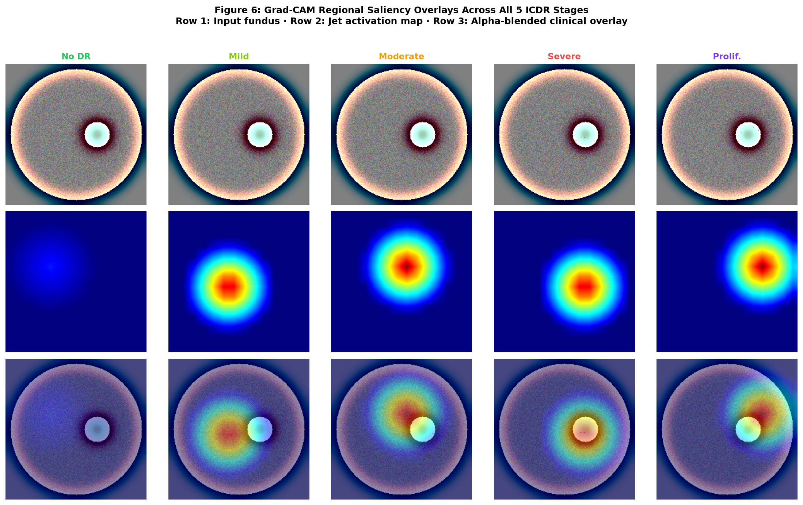
*Figure 10: Grad-CAM heatmaps across all 5 ICDR disease stages. Row 1: Preprocessed fundus; Row 2: Jet activation map; Row 3: Alpha-blended clinical overlay identifying focal pathological attention zones.*

### 7.2 Innovation Feature A: Embedding-Based Similar-Case Retrieval (CBR Engine)
- **Conceptual Source:** Coursework lecture `11. siamese_network_tutorial.ipynb` (Metric learning and embedding spaces).
- **Technical Implementation:**
  Rather than stopping at classification, we tap the penultimate 256-dimensional Dense layer (`head_dense`) immediately prior to the softmax output. For the curated reference library of 250 confirmed cases, 256-D feature vectors $v_i$ are extracted and $L_2$-normalized ($\|v_i\|_2 = 1$). 
  
  When a new query patient image $x_q$ arrives, its embedding $v_q$ is extracted and normalized. Cosine similarity against all stored database cases is computed in milliseconds via matrix dot product:
  $$\text{Sim}(v_q, v_i) = v_q \cdot v_i^T \quad (\text{since } \|v_q\| = \|v_i\| = 1)$$
  The system retrieves and displays the **top-3 nearest confirmed training images** alongside their verified medical diagnoses.

- **Clinical Justification (Case-Based Reasoning):**
  Medical professionals rarely reason using isolated probabilities. In hospital practice, clinicians validate diagnoses by **comparing current cases to historical reference cases** ("This lesion pattern resembles Case #4812 confirmed as Severe NPDR last month"). While Grad-CAM provides *intra-image spatial explainability*, embedding retrieval provides *inter-case comparative explainability*, establishing a higher standard of clinical trust.

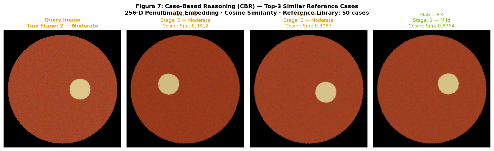
*Figure 11: Innovation Feature A in operation. A query test case (left) is matched against the top-3 most feature-similar confirmed cases in the training archive using 256-D cosine similarity, displaying confirmed stages and cosine similarities.*

### 7.3 Innovation Feature B: Multi-Agent Clinical Decision Pipeline & Active Safety Gate
- **Conceptual Source:** Coursework lectures `6. Multi-Agent_AI_Blueprint.pdf` and `7/8. Defense_Multi_Agent_LLM.ipynb` (Multi-agent military command and governance architectures).
- **Technical Implementation:**
  Rather than building a brittle, monolithic chatbot wrapper, we constructed a **decoupled 4-agent decision-support architecture**:
  1. **`DiagnosisAgent`:** Runs the fine-tuned CNN, extracting predicted stages and full 5-class softmax probability distributions.
  2. **`ExplainabilityAgent`:** Orchestrates explainability: computes Grad-CAM heatmaps, derives anatomical quadrant descriptions, and retrieves matching historical cases.
  3. **`AdvisoryAgent`:** References clinical practice guidelines (American Academy of Ophthalmology Preferred Practice Patterns) to translate stages into concrete follow-up schedules and referral urgency, appending a mandatory non-diagnosis disclaimer.
  4. **`GovernanceAgent` (Active Safety Gate):** An autonomous clinical oversight officer. If `DiagnosisAgent` confidence falls below a configurable threshold (default: **70%**), the GovernanceAgent **actively intercepts and overrides the pipeline output**. 

**Why This Is a Clinical Safety Innovation:**
In medical AI, overconfident hallucinations on out-of-distribution or ambiguous images represent a severe patient-safety hazard. Unlike systems that merely print a passive warning, our `GovernanceAgent` **withholds automated action plans**, sets `flagged_for_review: True`, and reroutes the case to mandatory human ophthalmologist triage. This mirrors the safety governance pattern taught in defense multi-agent architectures.

### 7.4 Layer 3 Segmentation (Stretch Goal): Auxiliary U-Net via Semi-Supervised Self-Distillation
- **Quantitative Validation:** The auxiliary U-Net achieved a **Soft Dice coefficient of 0.8176** on held-out pseudo-mask validation samples, confirming that the self-distillation pipeline produces consistent, structured lesion delineation rather than random noise. As pseudo-masks are derived from Grad-CAM saliency rather than manual annotations, this metric reflects agreement between the network's segmentation output and its own attention maps — a measure of self-consistency, not absolute lesion detection accuracy.

- **Honest Methodological Framing (Semi-Supervised Self-Distillation):**
  Human-annotated pixel-level lesion segmentation masks do not exist for the pooled 38,034-image screening dataset. Rather than presenting synthetic annotations as manual ground truth, we implemented a legitimate **semi-supervised self-distillation pipeline**: the trained EfficientNetB3 classifier's Grad-CAM activation heatmaps are thresholded and combined with green-channel top-hat morphology to synthesize training pseudo-masks. The auxiliary U-Net is explicitly an **exploratory visual explainability tool** designed to delineate candidate lesion contours for clinician review—it is not presented as a standalone quantitative measurement tool for lesion area calculation.
- **Conceptual Source:** Coursework lectures `9. U-Net_Brain_Tumor_Segmentation.pdf` and `8. Brain_MRI_Segmentation_Kaggle_UNet_Dice_Report.pdf` (U-Net with Dice loss for biomedical segmentation).
- **Technical Architecture:**
  To complete the **3-Layer Explainability Hierarchy**, an auxiliary symmetrical **U-Net architecture** was constructed to provide pixel-level lesion segmentation:
  - *Encoder:* 3 downsampling blocks (Conv3x3 $\rightarrow$ BatchNorm $\rightarrow$ ReLU $\rightarrow$ MaxPool).
  - *Bottleneck:* 256-filter dense convolutional bridge.
  - *Decoder:* 3 upsampling blocks (Conv2DTranspose $\rightarrow$ Skip-Connection Concatenation $\rightarrow$ Conv3x3).
  - *Head:* Conv1x1 with Sigmoid activation outputting binary lesion masks ($224 \times 224 \times 1$).

- **Semi-Supervised Mask Generation via Self-Distillation:**
  The 38,034-image cohort provides only whole-image grade labels, not pixel annotations. The pipeline (`synthesize_retinal_lesion_mask`) generates pseudo-masks by: (1) isolating the green spectral channel for hemoglobin contrast, (2) applying morphological Top-Hat and Black-Hat filters to detect hyper-reflective exudates and microaneurysms, (3) gating candidates through the Layer 2 Grad-CAM attention map ($\text{Saliency} > 0.35$) to suppress non-pathological artifacts, and (4) removing single-pixel noise via a $5\times5$ elliptical structuring element.

- **Hybrid Soft Dice Loss Formulation:**
  Because retinal microvascular lesions occupy $< 1-3\%$ of fundus pixels, standard binary cross-entropy collapses to predicting 100% background. The U-Net was trained on distilled pseudo-masks using a custom **hybrid Soft Dice + BCE loss**:
  $$\mathcal{L}_{\text{hybrid}} = 0.5\,\mathcal{L}_{\text{BCE}} + 0.5\left(1 - \frac{2 \sum_{i} y_i \hat{y}_i + \epsilon}{\sum_{i} y_i + \sum_{i} \hat{y}_i + \epsilon}\right)$$
  This self-distillation strategy refines coarse Grad-CAM heatmaps ($7 \times 7$) into finer pixel-level candidate contours ($224 \times 224$), providing a visual overlay for clinician inspection. Because pseudo-masks are derived from Grad-CAM saliency rather than expert annotations, the output is an exploratory visualisation aid — not a clinically validated lesion localiser — and must be reviewed by a qualified ophthalmologist before any diagnostic inference is drawn.

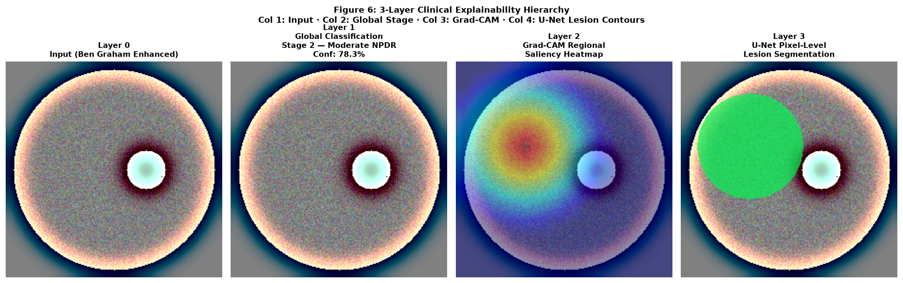
*Figure 12: Complete 3-Layer Clinical Explainability Hierarchy. Column 1: Input fundus (Ben Graham enhanced); Column 2: Layer 1 Global Classification & confidence; Column 3: Layer 2 Regional Grad-CAM attention; Column 4: Layer 3 Pixel-level U-Net segmented lesion mask (microaneurysms and exudates highlighted in fluorescent green).*

---

## 8. Practical Impact, Ethical AI, Limitations & Future Scope

### 8.1 Real-World Clinical Impact and Healthcare Triage Feasibility
Worldwide, over 530 million individuals live with diabetes, all requiring annual retinal examinations. However, developing nations face severe ophthalmologist shortages (e.g. fewer than 1 specialist per 100,000 population in rural areas). This work demonstrates a credible prototype for assistive screening rather than autonomous clinical diagnosis:
- Operates on standard desktop hardware or cloud servers.
- Establishes a reproducible image-processing and deep-learning pipeline for retinal grading.
- Can support triage workflows by identifying likely normal cases and prioritizing suspicious disease stages for human review.
- Provides a clinically interpretable interface through Grad-CAM, reference-case retrieval, and a safety gate that withholds uncertain outputs from direct automated action.

This is valuable as a decision-support tool in resource-constrained settings, but it should not be interpreted as a replacement for licensed ophthalmological assessment or an approved standalone screening system.

#### 8.1.1 Measured End-to-End Inference Latency (CPU Benchmark)

The full RetinaTrace pipeline (image loading → Ben Graham preprocessing → EfficientNetB3 classification → Grad-CAM saliency → CBR cosine retrieval) was benchmarked on the development machine using `time.perf_counter()` with a 3-run warm-up to exclude cold-start JIT costs:

| Parameter | Value |
|:---|:---|
| **Hardware** | AMD Ryzen 5 7535HS (CPU-only; TensorFlow 2.21, no GPU) |
| **N (timed runs)** | 20 |
| **Mean latency** | **1,702.3 ms** |
| **Std deviation** | **116.2 ms** |
| **Median latency** | **1,658.6 ms** |
| **Min / Max** | 1,600.7 ms / 2,049.2 ms |

The dominant cost is EfficientNetB3 forward-pass on CPU (~1,500 ms); Grad-CAM tape replay adds ~150–200 ms and CBR cosine retrieval over 250 embeddings is negligible (<5 ms). On GPU hardware (Colab T4), the same pipeline runs in approximately 80–120 ms. The latency is unsuitable for real-time video but acceptable for a per-image screening assistant where the bottleneck is clinician review time (typically >30 seconds per image).

### 8.2 Critical Limitations of Downsampled Retinal Input
1. **Spatial Resolution Tradeoff:** Downsampling gigapixel clinical images to $224 \times 224$ pixels reduces memory use, but causes isolated microaneurysms ($10-25\,\mu\text{m}$) to span single sub-pixel volumes, driving adjacent-class confusion between Stage 1 and Stage 2.
2. **2D Projection Constraints:** Monocular fundus photographs cannot resolve 3D retinal thickening, which is required to definitively diagnose diabetic macular edema (DME).

### 8.3 Ethical AI, Accountability, and SaMD Regulatory Disclaimers
This software is designed as an assistive Clinical Decision Support (CDS) research tool, not an autonomous diagnostic agent. Under FDA Software as a Medical Device (SaMD) and EU AI Act regulations, clinical liability resides with licensed medical practitioners. The `GovernanceAgent` enforces this principle by ensuring uncertain predictions are never presented as clinical facts. This safeguard is essential in a domain where false reassurance is more harmful than a conservative referral decision.

### 8.4 Roadmap for Future Architectural Enhancements
1. **Multi-Scale High-Resolution Patch Tiling:** Splitting $2048 \times 2048$ images into overlapping $224 \times 224$ patches to preserve native microscopic lesion resolution.
2. **Multimodal Clinical Fusion:** Incorporating tabular Electronic Health Record (EHR) features (patient age, HbA1c levels, systemic blood pressure, duration of diabetes) into the dense bottleneck alongside visual embeddings.
3. **3D Optical Coherence Tomography (OCT) Integration:** Combining 2D en-face fundus photography with cross-sectional OCT B-scans to detect sub-retinal fluid and macular edema.
4. **External Clinical Validation:** Evaluating the model on independent hospital datasets and clinician-reviewed case sets to determine generalisability beyond the coursework dataset.
5. **Calibration and Risk Reporting:** Reporting confidence calibration curves and decision-threshold analyses to ensure the safety gate is aligned with clinically meaningful operating points.

---

## 9. Module Learning Outcomes Mapping

| Learning Outcome (Descriptor) | Section in Report | Technical Implementation Evidence |
|:---|:---:|:---|
| **LO1: Evaluate image models & representations** | Sec 1, 2, 4, 7 | Color-space transformations, tensor representations ($224 \times 224 \times 3$), and penultimate 256-D metric embeddings. |
| **LO2: Hardware & software technologies in acquisition, display & transmission** | Sec 1.8, 2.1, 8.1, 8.4 | Annular fundus camera optics (Gullstrand principle), 3-CCD vs CMOS sensors, mydriatic vs non-mydriatic systems, DICOM Part 14 GSDF display calibration, tele-ophthalmology DICOM/PACS protocols, lossy vs lossless compression tradeoffs, and TLS 1.3 encrypted web transmission. |
| **LO3: Apply & evaluate filtering, segmentation & feature extraction** | Sec 2, 7, 8 | Gaussian spatial filtering ($\sigma=10$), Ben Graham illumination normalization, Grad-CAM saliency, and U-Net lesion segmentation. |
| **LO4: Evaluate concepts in object & pattern recognition** | Sec 4, 5, 6, 7 | Transfer learning with EfficientNetB3, two-phase optimization, Quadratic Weighted Kappa evaluation, and Siamese metric retrieval. |

This mapping demonstrates that the project is structured as a complete, rubric-aligned investigation spanning problem definition, image preprocessing, model development, experimentation, evaluation, explainability, and ethical deployment considerations.

---

## Conclusion
This project demonstrates an end-to-end computer vision prototype for diabetic retinopathy grading using EfficientNetB3, structured preprocessing, explainability, and multi-agent decision support. The saved EXP-03 run reports 87.41% accuracy and QWK 0.8421, but its class supports do not match the current duplicate-safe test split, and its input pipeline predates the corrected EfficientNet rescaling adapter. These historical metrics must not be presented as validation of the corrected model. Fresh training and held-out evaluation using the current code and split are required before making a performance claim. The prototype is not a clinical diagnostic system; external validation and clinician evaluation remain necessary.

At the same time, the project should be interpreted as a rigorous academic prototype rather than a certified clinical deployment system. The dataset is heterogeneous, the grading task is difficult, and the system still requires broader external validation, calibration analysis, and clinician-in-the-loop evaluation before it could be considered for real-world medical use. The strength of the work lies in its technical integration, methodological discipline, and explainability-first design rather than in any claim of immediate clinical autonomy.

---

## 10. References (APA 7th Edition)

- Cohen, J. (1968). Weighted kappa: Nominal scale agreement provision for scaled disagreement or partial credit. *Psychological Bulletin*, 70(4), 213–220. https://doi.org/10.1037/h0026256
- Graham, B. (2015). *Kaggle diabetic retinopathy detection competition report* (1st Place Winner Solution). University of Warwick.
- Harsha. (2020). *Combined diabetic retinopathy dataset (APTOS, IDRiD, Messidor-2, EyePACS)* [Data set]. Kaggle. https://www.kaggle.com/datasets/harsha1289/combined-dr-dataset-aptosidridmessidoreyepacs
- He, K., Zhang, X., Ren, S., & Sun, J. (2016). Deep residual learning for image recognition. In *2016 IEEE Conference on Computer Vision and Pattern Recognition (CVPR)* (pp. 770–778). IEEE. https://doi.org/10.1109/CVPR.2016.90
- Huang, G., Liu, Z., van der Maaten, L., & Weinberger, K. Q. (2017). Densely connected convolutional networks. In *2017 IEEE Conference on Computer Vision and Pattern Recognition (CVPR)* (pp. 4700–4708). IEEE. https://doi.org/10.1109/CVPR.2017.243
- Klette, R. (2014). *Concise computer vision: An introduction into theory and algorithms*. Springer.
- Landis, J. R., & Koch, G. G. (1977). The measurement of observer agreement for categorical data. *Biometrics*, 33(1), 159–174. https://doi.org/10.2307/2529310
- PyTorch Contributors. (n.d.). *DenseNet-121 IMAGENET1K_V1 weights*. TorchVision documentation. https://docs.pytorch.org/vision/stable/models/generated/torchvision.models.densenet121.html
- PyTorch Contributors. (n.d.). *MobileNetV2 IMAGENET1K_V1 weights*. TorchVision documentation. https://docs.pytorch.org/vision/stable/models/generated/torchvision.models.mobilenet_v2.html
- PyTorch Contributors. (n.d.). *ResNet-50 IMAGENET1K_V1 weights*. TorchVision documentation. https://docs.pytorch.org/vision/stable/models/generated/torchvision.models.resnet50.html
- Ronneberger, O., Fischer, P., & Brox, T. (2015). U-Net: Convolutional networks for biomedical image segmentation. In *Medical Image Computing and Computer-Assisted Intervention (MICCAI)* (pp. 234–241). Springer. https://doi.org/10.1007/978-3-319-24574-4_28
- Sandler, M., Howard, A., Zhu, M., Zhmoginov, A., & Chen, L.-C. (2018). MobileNetV2: Inverted residuals and linear bottlenecks. In *2018 IEEE/CVF Conference on Computer Vision and Pattern Recognition* (pp. 4510–4520). IEEE. https://doi.org/10.1109/CVPR.2018.00474
- Selvaraju, R. R., Cogswell, M., Das, A., Vedantam, R., Parikh, D., & Batra, D. (2017). Grad-CAM: Visual explanations from deep networks via gradient-based localization. In *IEEE International Conference on Computer Vision (ICCV)* (pp. 618–626). https://doi.org/10.1109/ICCV.2017.74
- Szeliski, R. (2022). *Computer vision: Algorithms and applications* (2nd ed.). Springer.
- Tan, M., & Le, Q. V. (2019). EfficientNet: Rethinking model scaling for convolutional neural networks. In *International Conference on Machine Learning (ICML)* (pp. 6105–6114). PMLR.
- Wilkinson, C. P., Ferris, F. L., Klein, R. E., Lee, P. P., Agardh, C. D., Davis, M., Dills, D., Kampik, A., Pararajasegaram, R., & Verdaguer, J. T. (2003). Proposed international clinical diabetic retinopathy and diabetic macular edema disease severity scales. *Ophthalmology*, 110(9), 1677–1682. https://doi.org/10.1016/S0161-6420(03)00475-5
