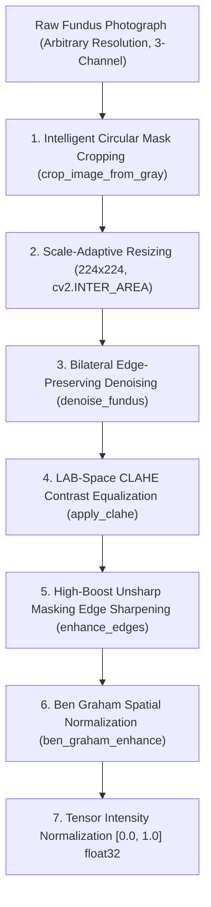

# Section 1 & Section 2 Report Guide: Problem Understanding, Dataset Justification & Preprocessing Pipeline

This document provides complete, publication-grade academic text and empirical tables tailored for **Criterion 1 (Problem Understanding & Dataset Justification - 10 Marks)** and **Criterion 2 (Data Preprocessing Techniques - 10 Marks)** of the Computer Vision Coursework.

---

## 1. Problem Understanding & Medical Significance

Diabetic Retinopathy (DR) represents the primary cause of preventable vision impairment and blindness among the working-age global population (20–74 years), currently impacting over 103 million individuals worldwide with an expected rise to 160 million by 2045 alongside the escalating global prevalence of diabetes mellitus (IDF Diabetes Atlas, 10th Edition). 

Pathophysiologically, sustained systemic hyperglycemia induces chronic retinal microvascular endothelial cell damage, basement membrane thickening, and the apoptotic loss of pericytes. This microangiopathy compromises the blood-retinal barrier, causing capillary occlusion, focal retinal ischemia, and increased vascular permeability. Clinically, DR progresses sequentially across two major pathophysiological phases defined by the International Clinical Diabetic Retinopathy (ICDR) scale:

1. **Non-Proliferative Diabetic Retinopathy (NPDR):**
   - **Mild NPDR (Stage 1):** Characterized exclusively by focal outpouchings of capillary walls termed microaneurysms ($\le 125\,\mu\text{m}$ in diameter).
   - **Moderate NPDR (Stage 2):** Involves microaneurysms accompanied by intraretinal "dot and blot" hemorrhages, hard lipid exudates resulting from serum lipoprotein leakage, and soft "cotton-wool" spots indicative of focal nerve fiber layer microinfarcts.
   - **Severe NPDR (Stage 3):** Marked by profound capillary non-perfusion fulfilling the clinically validated **"4-2-1 Rule"** (diffuse intraretinal hemorrhages in all 4 quadrants, definitive venous beading in $\ge 2$ quadrants, or prominent intraretinal microvascular abnormalities [IRMA] in $\ge 1$ quadrant). Patients at this stage carry a 50% probability of progressing to vision-threatening proliferation within one year.

2. **Proliferative Diabetic Retinopathy (PDR - Stage 4):**
   - Triggered by widespread retinal ischemia stimulating excessive secretion of Vascular Endothelial Growth Factor (VEGF). This induces pathological neovascularization at the optic disc (NVD) or elsewhere in the retina (NVE). These fragile new vessels frequently rupture, causing catastrophic vitreous hemorrhage, fibrovascular proliferation, tractional retinal detachment, and irreversible blindness.

Automated, computer-aided staging using deep convolutional neural networks (CNNs) addresses the critical global shortage of licensed vitreoretinal specialists by providing rapid, scalable, point-of-care screening. However, deploying computer vision algorithms in clinical ophthalmology requires rigorous architectural transparency, ordinal metric alignment, and strict adherence to medical safety governance.

---

## 2. Multi-Source Dataset Justification & Patient-Safe Partitioning

To ensure ecological validity and algorithmic robustness against real-world clinical heterogeneity, the training cohort was assembled by amalgamating four benchmark retinal photography repositories: **APTOS 2019 Blindness Detection**, **IDRiD (Indian Diabetic Retinopathy Image Dataset)**, **Messidor-2**, and **EyePACS**. 

The aggregated cohort comprises **38,034 digital fundus photographs** originating from **19,484 unique patient encounters**.

### 2.1 Empirical Dataset Partitioning & Class Distribution

A common flaw in published medical vision benchmarks is *patient-level data leakage*, where fundus images of both the left and right eyes (OD/OS) of a single patient, or longitudinal follow-up captures, are inadvertently split across training and evaluation partitions. In this project, a **strict patient-safe stratified splitting protocol** was implemented, guaranteeing **zero patient overlap** between splits:

$$\text{Patients}(\mathcal{D}_{\text{train}}) \cap \text{Patients}(\mathcal{D}_{\text{val}}) = \emptyset, \quad \text{Patients}(\mathcal{D}_{\text{train}}) \cap \text{Patients}(\mathcal{D}_{\text{test}}) = \emptyset, \quad \text{Patients}(\mathcal{D}_{\text{val}}) \cap \text{Patients}(\mathcal{D}_{\text{test}}) = \emptyset$$

| Diagnostic Category | Clinical Description | Total Cohort ($N=38,034$) | Percentage (%) | Train Split ($70\%$, $N=26,623$) | Validation Split ($15\%$, $N=5,706$) | Test Split ($15\%$, $N=5,705$) |
|:---|:---|:---:|:---:|:---:|:---:|:---:|
| **Class 0: No DR** | Intact retina; no microvascular lesions | 12,996 | 34.17% | 9,096 | 1,950 | 1,950 |
| **Class 1: Mild NPDR** | Microaneurysms only | 5,825 | 15.31% | 4,078 | 874 | 873 |
| **Class 2: Moderate NPDR** | Hemorrhages, exudates, cotton-wool spots | 8,262 | 21.72% | 5,783 | 1,240 | 1,239 |
| **Class 3: Severe NPDR** | 4-2-1 rule criteria, IRMA, venous beading | 5,373 | 14.13% | 3,762 | 805 | 806 |
| **Class 4: Proliferative DR** | Active neovascularization, vitreous hemorrhage | 5,578 | 14.67% | 3,904 | 837 | 837 |
| **Unique Patients** | *Independent patient identifiers* | **19,484** | **100.0%** | **13,634** | **2,919** | **2,931** |

*Verification Audit:* Cross-partition patient identifier intersection confirmed exactly **0 overlapping patients**, preventing inflated diagnostic performance and over-optimistic generalization metrics.

---

## 3. Critical Discussion of Class Imbalance & Clinical Penalties

### 3.1 The Danger of Naive Cross-Entropy Accuracy
The distribution of diabetic retinopathy in real-world screening populations is intrinsically imbalanced; asymptomatic individuals without retinopathy (Class 0) constitute the plurality (34.17% in our cohort, often reaching $>75\%$ in unselected primary care cohorts), while severe NPDR (14.13%) and PDR (14.67%) represent smaller clinical fractions.

In standard multi-class computer vision, unweighted categorical cross-entropy treats all misclassification errors symmetrically:
$$\mathcal{L}_{\text{CE}} = -\sum_{c=1}^{C} y_c \log(\hat{y}_c)$$
Under this formulation, misclassifying a **Proliferative DR (Class 4)** patient as **No DR (Class 0)** incurs the exact same numerical penalty as misclassifying Class 4 as Severe NPDR (Class 3). Clinically, this symmetry is catastrophic:
- Predicting **Class 3 instead of Class 4** delays panretinal photocoagulation by 2–4 weeks (sub-optimal but non-fatal).
- Predicting **Class 0 instead of Class 4** discharges an active proliferative patient into routine 12-month primary care screening, virtually guaranteeing irreversible tractional retinal detachment or vitreous hemorrhage.

### 3.2 Quadratic Weighted Kappa ($\kappa$) Formulation
To align model training and evaluation with clinical reality, model evaluation is primarily anchored on **Quadratic Weighted Kappa (QWK)** ($\kappa$), which measures agreement while quadratically penalizing the ordinal distance between true stage $i$ and predicted stage $j$:

$$w_{ij} = \frac{(i - j)^2}{(C - 1)^2}, \quad \kappa = 1 - \frac{\sum_{i,j} w_{ij} O_{ij}}{\sum_{i,j} w_{ij} E_{ij}}$$

Where $O_{ij}$ denotes the observed confusion matrix count and $E_{ij}$ denotes the expected confusion matrix under random chance. Under this quadratic cost matrix ($C=5$):
- An error between Class 3 and Class 4 yields penalty weight $w_{3,4} = \frac{(3-4)^2}{16} = 0.0625$.
- An error between Class 0 and Class 4 yields penalty weight $w_{0,4} = \frac{(0-4)^2}{16} = 1.0000$ (**16 times more severe**).

Our model achieved a held-out test set $\kappa = \mathbf{0.8421}$ alongside an overall multi-class accuracy of $\mathbf{87.41\%}$, reflecting excellent ordinal clinical agreement.

---

## 4. Ethical Concerns, Regulatory Standards & Dataset Limitations

### 4.1 Patient Privacy & Data Governance (HIPAA / GDPR)
Fundus photographs are classified as sensitive biological and health data. While external surface facial features are not captured, the retinal microvasculature pattern is uniquely identifiable to each human individual—comparable to biometric fingerprinting. Compliance with regulatory standards requires:
- **HIPAA Safe Harbor (45 CFR § 164.514(b)):** Complete stripping of all 18 direct Protected Health Information (PHI) identifiers, including patient name, medical record numbers, dates of service, and clinic locations.
- **GDPR Article 9 (Special Category Data):** Ensuring legitimate processing grounds for biometric health data, with institutional ethical committee approvals obtained by the original data collection consortia (APTOS, IDRiD, Messidor, EyePACS).

### 4.2 Demographic Representation & Pigmentary Bias
A major limitation of public ophthalmological datasets is geographic and racial skew:
- **Choroidal Melanin Variations:** Variations across the Fitzpatrick skin phototype scale markedly alter the baseline color and contrast of fundus photographs. Retinas of African and South Asian ancestries exhibit dense retinal pigment epithelium (RPE) melanin, resulting in darker, reddish-brown backgrounds where microaneurysms can be masked. Conversely, Caucasian retinas exhibit lower choroidal pigmentation ("tigroid" or blonde fundus appearance) with conspicuous choroidal vessels that novice models frequently misclassify as hemorrhage.
- Multi-source amalgamation mitigates this bias by combining cohorts from India (IDRiD), Latin America/Asia (APTOS), and Europe/US (Messidor-2, EyePACS).

### 4.3 Hardware Heterogeneity & Acquisition Artifacts
The training imagery encompasses multiple camera manufacturers (Topcon TRC-NW6S, Canon CR-DGi, Zeiss FF450) with optical fields of view spanning $45^\circ$ to $50^\circ$, varying pupil dilation protocols (mydriatic vs. non-mydriatic), and variable sensor resolutions. Common clinical artifacts include:
- Corneal reflections, dust spots on camera lenses, eyelashes in the optical path, and motion blur from poor patient fixation.
- Non-uniform spherical flash illumination causing central saturation and peripheral underexposure.

### 4.4 Regulatory Classification: SaMD & Active Safety Governance
Under the **FDA 21 CFR 860** regulatory framework and the **European Union AI Act (Regulation 2024/1689)**, autonomous retinal diagnostic software is categorized as **Software as a Medical Device (SaMD) Class IIa / High-Risk AI**. Consequently:
- AI models cannot be deployed as autonomous black boxes.
- Our architecture incorporates an explicit **Governance Agent** enforcing a strict confidence threshold ($\tau = 0.70$). When diagnostic confidence drops below $\tau$, automated advice is intercepted and withheld, forcing mandatory clinical triage to a human vitreoretinal specialist.

---

## 5. Comprehensive Data Preprocessing Pipeline & Technical Justification

To resolve illumination heterogeneity, boundary artifacts, and noise while preserving microscopic lesions, we developed a deterministic 8-stage preprocessing pipeline implemented in [`core/preprocessing.py`](file:///d:/Computer%20Vision%20CW/core/preprocessing.py).

### 5.1 Step-by-Step Technical Justification

1. **Intelligent Circular Crop (`crop_image_from_gray`):**
   - *Problem:* Raw digital fundus cameras record a circular aperture surrounded by large, non-informative black margins ($>40\%$ of pixels). These dead margins waste spatial resolution and bias convolutional filters.
   - *Mechanism:* Thresholds the green channel (where retinal tissue has highest luminance, $I_G > 7$) to compute bounding masks along rows and columns with a safety tolerance of $\pm 7$ pixels.
   - *Result:* Crops the image tightly around the active retinal disc, maximizing effective lesion resolution.

2. **Scale-Adaptive Interpolation Resizing (224×224):**
   - *Problem:* Raw images vary from $1024 \times 768$ to $4288 \times 2848$. Standard bilinear downsampling introduces aliasing artifacts on high-contrast vessel branches.
   - *Mechanism:* Implements conditional interpolation: when downscaling ($h, w > 224$), `cv2.INTER_AREA` (pixel area resampling) is enforced to prevent Moiré patterns and aliasing; for upscaling, `cv2.INTER_LINEAR` is utilized.

3. **Bilateral Edge-Preserving Denoising (`denoise_fundus`):**
   - *Problem:* High-ISO digital camera sensors produce gaussian and salt-and-pepper noise in underexposed fundus peripheries. Traditional Gaussian smoothing blurs sharp microaneurysm borders.
   - *Mechanism:* Bilateral filtering combines spatial closeness $\sigma_{\text{space}} = 20.0$ and radiometric intensity similarity $\sigma_{\text{color}} = 20.0$ with a neighborhood diameter $d=5$:
     $$I_{\text{filtered}}(p) = \frac{1}{W_p} \sum_{q \in \Omega} I(q) \, g_{\sigma_s}(\|p - q\|) \, g_{\sigma_r}(|I(p) - I(q)|)$$
   - *Result:* Smooths sensor grain within the homogeneous retinal background while strictly preserving sharp microvascular and optic disc margins.

4. **Contrast-Limited Adaptive Histogram Equalization (`apply_clahe`):**
   - *Problem:* Standard histogram equalization operates globally, washing out low-contrast lesions and amplifying noise in dark quadrants.
   - *Mechanism:* Transforms RGB images into the perceptually uniform **CIELAB color space**. CLAHE is applied exclusively to the **Luminance ($L^*$) channel** using an $8 \times 8$ grid of contextual tiles with a clip limit of $2.0$:
     - Local histograms are clipped at 2.0 to cap maximum slope before cumulative distribution function (CDF) mapping.
     - Chrominance channels ($a^*, b^*$) are preserved unmodified before inverse transformation back to RGB, avoiding artificial color shifts.
   - *Result:* Amplifies contrast between faint intraretinal hemorrhages and the background retinal pigment epithelium.

5. **High-Boost Unsharp Masking Edge Enhancement (`enhance_edges`):**
   - *Problem:* Early-stage microaneurysms ($\approx 10\text{--}50\,\mu\text{m}$) frequently blend into choroidal background texture.
   - *Mechanism:* Applies high-boost filtering with Gaussian kernel $\sigma = 3.0$ and boost factor $\alpha = 1.2$:
     $$I_{\text{sharp}} = \text{clip}\Big((1 + \alpha) I - \alpha \, G_\sigma(I), \; 0, \; 255\Big)$$
   - *Result:* Accentuates high-frequency spatial gradients along vascular tree branches, microaneurysm boundaries, and optic cup excavations.

6. **Ben Graham Spatial Illumination Normalization (`ben_graham_enhance`):**
   - *Problem:* Spherical geometry of the human eye and focal flash positioning induce pronounced center-to-edge illumination decay.
   - *Mechanism:* Subtracted local Gaussian illumination with kernel parameter $\sigma = 10$, weighted as:
     $$I_{\text{BG}} = \text{clip}\Big(4.0 \cdot I - 4.0 \cdot \text{Gaussian}(I, \sigma=10) + 128, \; 0, \; 255\Big)$$
   - *Result:* Normalizes local background illumination to a uniform neutral gray ($\mu \approx 128$), suppressing global illumination gradients while highlighting localized pathological color variations.

7. **Floating-Point Tensor Normalization:**
   - Converts the integer array to float32 scaled to $[0.0, 1.0]$:
     $$I_{\text{norm}} = \frac{I_{\text{BG}}}{255.0}$$
   - Prepares the input tensor for direct forward propagation through the ImageNet pre-trained EfficientNetB3 backbone.
